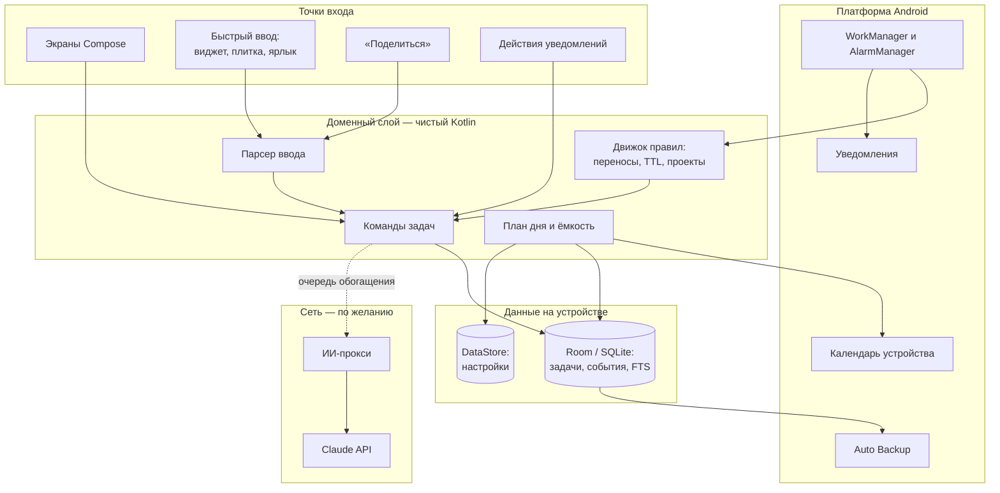
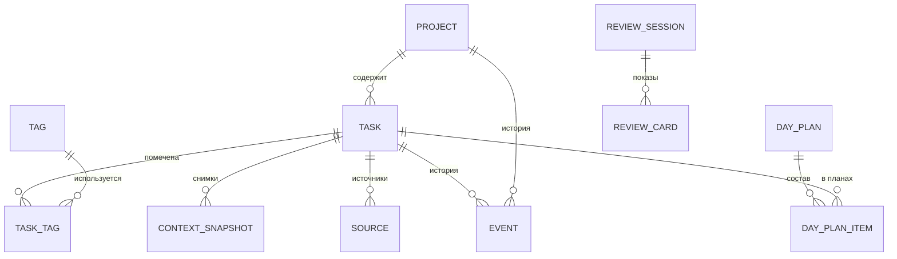
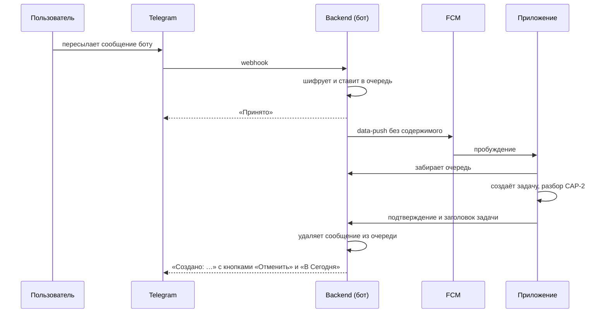
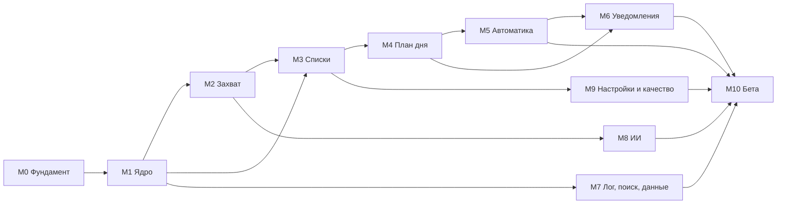

# Технический план: Android-менеджер задач без обслуживания

- **Основание:** [ТЗ от 2026-10-06](tz-task-manager.md); идентификаторы требований (CAP-1, PLN-5 …) взяты из него.
- **Версия:** 0.1, черновик от 2026-10-06.
- **Охват:** MVP (требования M) — детально; следующая версия (L) — на уровне архитектуры, чтобы решения MVP её не блокировали.
- **Требует согласования:** решения по открытым вопросам (§2) и прочтение неоднозначных мест ТЗ (§3).

## Содержание

1. [Резюме решений](#1-резюме-решений)
2. [Решения по открытым вопросам](#2-решения-по-открытым-вопросам)
3. [Интерпретации ТЗ](#3-интерпретации-тз)
4. [Архитектура](#4-архитектура)
5. [Стек и минимальные версии](#5-стек-и-минимальные-версии)
6. [Структура проекта](#6-структура-проекта)
7. [Модель данных](#7-модель-данных)
8. [Доменное ядро](#8-доменное-ядро)
9. [Разбор ввода](#9-разбор-ввода)
10. [План дня и ёмкость](#10-план-дня-и-ёмкость)
11. [Автоматика](#11-автоматика)
12. [Уведомления и фоновая работа](#12-уведомления-и-фоновая-работа)
13. [Точки захвата](#13-точки-захвата)
14. [Интерфейс](#14-интерфейс)
15. [Поиск, лог и архив](#15-поиск-лог-и-архив)
16. [Экспорт и резервные копии](#16-экспорт-и-резервные-копии)
17. [ИИ-функции](#17-ии-функции)
18. [Backend](#18-backend)
19. [Интеграции следующей версии](#19-интеграции-следующей-версии)
20. [Нефункциональные требования](#20-нефункциональные-требования)
21. [Безопасность и приватность](#21-безопасность-и-приватность)
22. [Тестирование и приёмка](#22-тестирование-и-приёмка)
23. [Метрики и телеметрия](#23-метрики-и-телеметрия)
24. [CI/CD и выпуск](#24-cicd-и-выпуск)
25. [План работ](#25-план-работ)
26. [Риски и спайки](#26-риски-и-спайки)
27. [Матрица трассировки](#27-матрица-трассировки)
28. [Ближайшие шаги](#28-ближайшие-шаги)

## 1. Резюме решений

| Область | Решение |
| --- | --- |
| Платформа | Нативное Android-приложение: Kotlin, Jetpack Compose, Material 3. minSdk 26 (Android 8.0); targetSdk — уровень, который требует Google Play на дату релиза |
| Данные | Local-first: источник правды — Room/SQLite на устройстве. Без сети работает всё, кроме ИИ и интеграций |
| Аккаунт | В MVP нет. Облачная копия — через Android Auto Backup; аккаунт появляется вместе с интеграциями (L3) |
| Изменения | Любое изменение — команда доменного слоя: одна транзакция «данные + событие». Из журнала событий строятся история задачи, журнал автоматики, отмена и метрики |
| Автоматика | Только правила, без ИИ. Идемпотентная догоняющая обработка от дат: пропущенные фоновые запуски не порождают лавину действий |
| Разбор ввода | Собственный детерминированный парсер на чистом Kotlin, языковые пакеты ru/uk/en, чипы прямо при наборе. ИИ только дозаполняет пустые поля в фоне |
| ИИ | Собственный тонкий ИИ-прокси с типизированными маршрутами; провайдер — Claude API. Работает только после явного согласия, выключается одним переключателем |
| Фон | WorkManager и неточные будильники AlarmManager. Без foreground service и без точных будильников |
| Интеграции (L) | Telegram — бот, relay-очередь и push; GitHub — опрос с устройства по токену GitHub App |
| Сроки | MVP — этапы M0–M10, ориентир 16–20 недель на одного разработчика; затем L1–L4 |

## 2. Решения по открытым вопросам

Ответы на раздел 12 ТЗ. Решение 7 — техническое следствие продуктового вопроса.

| # | Вопрос | Рекомендация | Почему и что это меняет |
| --- | --- | --- | --- |
| 1 | Синхронизация между устройствами | Один телефон в v1. Модель данных готова к синхронизации: UUID, `updated_at`, журнал изменений по полям | ТЗ относит синхронизацию к «вне рамок»; это отдельный крупный проект (сервер, конфликты, шифрование). Готовность модели почти ничего не стоит |
| 2 | Где обрабатывать язык | Гибрид. Разбор по правилам — всегда на устройстве. LLM — внешний сервис через собственный прокси, только с согласия. Интерфейс `AiGateway` позволяет позже добавить модель на устройстве | Критичный путь (ввод, даты, оценки) работает офлайн по принципу 8. Модели на устройстве пока доступны на ограниченном круге телефонов и слабее на ru/uk |
| 3 | DAT-8 в MVP | Нет; первым пунктом этапа L1 | Не нужно для проверки главной гипотезы. Добавляется миграцией без переделки ядра. Риск: часть бета-тестеров ждёт повторов — отслеживать отзывы |
| 4 | Аккаунт в MVP | Нет. Облако — Android Auto Backup (копия в Google-аккаунте устройства), плюс ежедневная локальная копия и экспорт | Убирает из MVP аутентификацию, серверную БД и хранение персональных данных. Свой аккаунт нужен в L3 для Telegram |
| 5 | Языки разбора в MVP | Все три через языковые пакеты; порядок готовности ru → en → uk | Движок общий; пакет — словари, шаблоны и тестовый корпус. Если сроки поджимают, uk отключается флагом без изменения архитектуры |
| 6 | Монетизация | Решение продуктовое. Техническая подготовка: слой `Entitlements` для платных функций и учёт стоимости ИИ на установку в прокси | Главный технический вход — стоимость ИИ (§17.5). Кандидаты в платное: ИИ-функции, интеграции, облачная копия |
| 7 | Рабочее название | Зафиксировать `applicationId` до первой загрузки в Google Play — его нельзя поменять. Брать нейтральный идентификатор, не привязанный к бренду | Отображаемое название меняется в любой момент |

## 3. Интерпретации ТЗ

ТЗ местами допускает два прочтения. Ниже — прочтение, принятое в плане. Пункты со знаком ★ влияют на приёмку; их нужно подтвердить до этапа, указанного в скобках.

1. **Проверка актуальности — признак, а не статус.** В таблице атрибутов «На проверке» — признак, на диаграмме — состояние. Храним признак `in_review` у задачи в статусе «Открыта» (TTL-3).
2. **TTL действует только на статус «Открыта»**, как на диаграмме. Задачи «В работе» и «На паузе» всегда в кандидатах плана (PLN-4); долгие паузы ловит обзор (REV-2).
3. **«На паузе → Выполнена» напрямую.** EXC-1 описывает путь через «В работе», но свайп «выполнено» по задаче на паузе должен работать.
4. **Корзина «Сегодня» в порядке кандидатов** (PLN-4 её не называет) стоит в группе «план-дата сегодня и перенесённые».
5. ★ **Буфер — доля свободного времени (M4):** `ёмкость = (рабочее время − занятость) × (1 − буфер)`. Для текущего дня считается только оставшееся рабочее время.
6. **«Ближайшие 2 дня» (DAT-6)** — дедлайн не позже `сегодня + 2`: в среду кандидатом становится задача с дедлайном в пятницу.
7. ★ **Автоподбор — «первый подходящий» (M4).** Кандидаты идут по порядку; не поместившийся уходит в «Не влезает», а подбор продолжается меньшими задачами. Ёмкость не превышается никогда. Альтернатива — останавливаться на первом не поместившемся; она хуже использует день, когда первой стоит большая задача.
8. ★ **Счётчик переносов (M4)** растёт на 1, когда: пользователь сдвигает на более позднюю дату задачу, которая была «на сегодня»; прошла план-дата (один раз на каждую дату); закончился день, в который пользователь открывал приложение, а задача из принятого плана или корзины «Сегодня» не выполнена. Не больше +1 за логический день. Дни без активности переносов не добавляют, поэтому после двух недель отсутствия у задачи максимум +1 (сценарий 7, §10.6).
9. ★ **Граница дня — 04:00 по местному времени (M1).** Работа после полуночи относится ко вчерашнему дню. Граница задаёт «сегодня» для плана, переносов, просрочки дедлайнов без времени и лога.
10. ★ **Пропуск в очереди проверки (M5)** засчитывается, только если карточку показали, а сессия закончилась без решения. Непоказанные карточки и дни без открытия очереди не считаются, иначе отпуск приводил бы к автоархиву.
11. **«Вне плана» в сводке дня (LOG-2)** — выполнено, но не входило в принятый план этого дня. Задачи CAP-8 — всегда «вне плана».
12. ★ **«Разбить» в MVP — ручная разбивка (M4).** В DAT-3 и PLN-8 пользователь вводит 2–5 шагов строками, задача превращается в проект (§8.5). ИИ-предложение шагов появится с EXE-2 (L1). Это согласуется с приёмкой: сценария 5 нет в списке «без LLM».
13. **Синтаксис ввода** (в ТЗ задан только `#`): `#имя` — проект, существующий или новый (чип «новый проект» убирается тапом); `@тег` — тег; `S`/`M`/`L` — оценка. Слова горизонта: «сегодня» — корзина Сегодня, «на неделе» — Неделя, «когда-нибудь» — Когда-нибудь. Дата без маркера — план-дата. Время без маркера дедлайна остаётся в тексте: у план-даты нет времени.
14. ★ **Ссылка на сообщение Telegram (M2, L3).** Через «Поделиться» Telegram, по имеющимся сведениям, передаёт только текст (для публичных каналов — ссылку t.me). Bot API даёт ссылку на конкретное сообщение только для каналов; для личного чата — максимум на чат отправителя. Предлагаем уточнить сценарий 1 и TG-2: «ссылка на сообщение, если её передал источник; иначе — на приложение или чат». Проверяется спайком S1.
15. **Восстановление из архива (TTL-8)** ставит статус «Открыта» (как на диаграмме) и сохраняет корзину и проект. Если проект в архиве, восстанавливается и он.
16. **Отмена автоматического действия (AUT-1)** откатывает только поля, которые с тех пор не менялись. Иначе приложение сообщает об этом и предлагает открыть задачу.
17. **Напоминание о дедлайне в тихие часы (NTF-4).** По ТЗ оно приходит после тихих часов. Исключение: если так оно придёт позже самого дедлайна, отправляем его до начала тихих часов.
18. **Нерабочий день:** ёмкость 0, утреннее уведомление не приходит. План можно собрать вручную, перегруз виден.
19. **Пустой текст после разбора** («завтра #client M»): текстом задачи становится исходная строка, поля всё равно извлекаются.
20. **Ссылки (EXC-5):** URL выносится из текста в ссылки карточки. Если кроме URL ничего нет, текст — укороченный URL (домен и путь).
21. **WIP-лимит (DAT-7)** считает только статус «В работе».
22. **Задачи на проверке** не попадают в автоподбор плана, кроме групп с дедлайнами (PLN-4, группы 1–2).
23. **Принятие автоплана — не касание.** Иначе задачи, которые система предлагает каждый день, никогда не устаревали бы. Ручное добавление в план и перестановка — касание.

**Предложения к ТЗ** (в план не входят без согласования):

- Корзина по экрану захвата: задача, введённая на экране «Сегодня», сразу попадает в корзину «Сегодня». В базовом плане — по ТЗ, во «Входящие».
- Кнопка «Принять план» прямо в утреннем уведомлении: в типичное утро приложение можно не открывать.
- Виджет «Сегодня» с текущей задачей и следующим шагом — после MVP.

## 4. Архитектура

### 4.1 Обзор



### 4.2 Принципы

- **Один источник правды.** Интерфейс подписан на Flow из Room; параллельных кэшей состояния нет.
- **Изменения только через команды.** Команда в одной транзакции проверяет переход, меняет данные, обновляет касание, пишет события и поисковый индекс. Побочные эффекты — будильники, виджет, очередь ИИ — выполняются после коммита.
- **Чистая доменная логика.** Парсер, правила, план и ёмкость не зависят от Android и получают время через внедряемые часы. Это даёт быстрые JVM-тесты и проверку сценариев «через N дней».
- **Производное не храним.** «Просрочена», «кандидат», «нет следующего шага» вычисляются из дат и статусов. Храним только то, что требует памяти: признак проверки, счётчики, план дня.
- **Догоняющая обработка вместо точного расписания.** Любой запуск правил приводит состояние к «сегодня» и безопасен при повторе.
- **Объяснимость по построению.** Событие автоматики без кода причины не проходит валидацию (принцип 7).
- **Сеть — только ускоритель.** Сетевые шаги асинхронны, стоят в очереди с повтором и никогда не блокируют ввод (принцип 8).

### 4.3 Поток данных

1. Экран отправляет действие во ViewModel.
2. ViewModel вызывает команду доменного слоя: `Complete(taskId)`, `Postpone(taskId, Tomorrow)` и т. п.
3. `CommandExecutor` в одной транзакции Room применяет изменение, пишет события и обновляет индекс поиска.
4. Запросы-Flow из Room обновляют `UiState` подписанных экранов, виджет и уведомления.
5. После коммита выполняются эффекты: перепланирование напоминаний, обновление виджета, постановка задачи в очередь ИИ.

Черновик строки ввода переживает смерть процесса через `SavedStateHandle`.

## 5. Стек и минимальные версии

| Область | Выбор | Комментарий |
| --- | --- | --- |
| Язык | Kotlin 2.x (K2), coroutines, Flow | |
| UI | Jetpack Compose, Material 3, material3-adaptive | Одна Activity. Фиксированная палитра без dynamic color, чтобы красный оставался только у просрочки (DAT-1) |
| Навигация | Navigation 3, если стабильна на старте; иначе Navigation Compose с типобезопасными маршрутами | Решение в M0 |
| DI | Hilt (KSP) | |
| БД | Room на платформенном SQLite, FTS4 с токенайзером `unicode61` | Без нативных библиотек — не нужна отдельная сборка под 16 КБ страницы памяти; FTS4 есть во всех версиях Android |
| Настройки | DataStore с типизированной схемой на kotlinx.serialization | Значения по умолчанию в коде |
| Фон | WorkManager, AlarmManager (неточные окна) | Без foreground service и точных будильников |
| Виджет | Jetpack Glance | |
| Сериализация | kotlinx.serialization | Экспорт, бэкап, DTO прокси |
| Сеть | Ktor Client с движком OkHttp | Только ИИ-прокси (MVP) и интеграции (L) |
| Дата и время | java.time и внедряемые часы | При minSdk 26 desugaring не нужен |
| Секреты | Android Keystore и Tink | Библиотека security-crypto (EncryptedSharedPreferences) объявлена устаревшей |
| Биометрия | androidx.biometric | |
| Речь | RecognizerIntent или SpeechRecognizer | Выбор по спайку S2 |
| Списки | Paging 3 для лога и поиска | |
| Тесты | JUnit, property-тесты (kotest-property или аналог), Turbine, Robolectric, Compose UI Test, Roborazzi, Macrobenchmark | |
| Качество кода | ktlint, detekt, Android Lint | Собственное правило detekt: запрет `LocalDate.now()` и `Instant.now()` вне часов |
| Отчёты о падениях | Crashlytics или Sentry — выбор в M0 | Без текстов задач в отчётах |
| Backend | Kotlin, Ktor, официальный Anthropic Java SDK | В MVP — только ИИ-прокси |
| CI | GitHub Actions | |

**Минимальные версии.**

- **minSdk 26 (Android 8.0).** Даёт java.time и каналы уведомлений без обходных путей и покрывает подавляющее большинство активных устройств. На старых версиях часть возможностей деградирует мягко:
  - до Android 10 нет системной тёмной темы — приложение светлое;
  - до Android 13 нет системного предложения добавить плитку — показываем инструкцию;
  - до Android 13 язык приложения нельзя выбрать в системных настройках — переключатель внутри приложения;
  - до Android 12 нет распознавания речи на устройстве через `SpeechRecognizer` — остаётся системный диалог.
- **targetSdk** — уровень, который требует Google Play на дату релиза: с 31.08.2025 — не ниже 35; перед релизом проверить актуальное требование. Учитываем edge-to-edge, запрет запуска активностей из уведомлений через посредников и разрешение на уведомления.
- **Эталонное устройство** для бюджетов производительности — средний класс уровня Samsung Galaxy A3x/A5x последних поколений; конкретная модель фиксируется в M0.

## 6. Структура проекта

Одна Gradle-сборка: приложение и backend делят чистые Kotlin-модули (контракт ИИ-маршрутов).

```
Tasker/
├── app/                    точка входа, навигация, DI-граф, Application
├── core/
│   ├── model/              [JVM] доменные типы: Task, Project, Bucket, Estimate, ReasonCode…
│   ├── domain/             [JVM] статусы, правила, план и ёмкость, TTL, переносы, происхождение полей
│   ├── parser/             [JVM] разбор ввода и языковые пакеты ru/uk/en
│   ├── ai-contract/        [JVM] DTO и схемы ИИ-маршрутов (общие с backend)
│   ├── database/           Room: сущности, DAO, FTS, миграции, экспорт схем
│   ├── data/               репозитории, CommandExecutor, журнал событий, настройки
│   ├── calendar/           чтение занятости (CAL-1); запись плана (CAL-2, L)
│   ├── notifications/      каналы, шлюз уведомлений, построение, действия
│   ├── scheduling/         WorkManager-задачи, будильники, MaintenanceRunner, приёмники системных событий
│   ├── ai/                 AiGateway, клиент прокси, согласие, очередь обогащения
│   ├── backup/             экспорт JSON/Markdown, бэкап, восстановление, импорт (L)
│   ├── designsystem/       тема, токены, базовые компоненты
│   ├── ui/                 общие компоненты: строка задачи со свайпами, чипы, шкала ёмкости, отмена
│   └── testing/            управляемые часы, фабрики данных, фейки репозиториев и ИИ
├── feature/
│   ├── capture/            строка ввода, QuickCaptureActivity, «Поделиться», плитка, голос
│   ├── today/              «Сегодня» и «План дня»
│   ├── inbox/              «Входящие» и быстрый разбор
│   ├── tasks/              Неделя, Когда-нибудь, Проекты, карточка проекта
│   ├── task/               карточка задачи, пауза и снимки контекста
│   ├── review/             проверка актуальности; обзор недели (L)
│   ├── done/               лог сделанного и сводки
│   ├── search/             поиск, фильтры, архив
│   ├── journal/            журнал автоматики
│   └── settings/           настройки, интеграции, онбординг
├── widget/                 Glance-виджеты
├── integrations/           (L) telegram/, github/
├── benchmark/              Macrobenchmark и генерация Baseline Profile
├── backend/                ИИ-прокси (MVP); аккаунты, relay, бэкапы (L)
├── build-logic/            convention-плагины Gradle
└── docs/                   ТЗ, техплан, ADR, отчёты спайков
```

Правила зависимостей:

- `core:model`, `core:domain`, `core:parser`, `core:ai-contract` — чистый Kotlin/JVM без Android SDK.
- Модули `feature:*` не зависят друг от друга; навигация между ними собирается в `app`.
- БД доступна только через `core:data`; фичи не видят DAO.
- Версии зависимостей — в `gradle/libs.versions.toml`, общая конфигурация — в convention-плагинах.

## 7. Модель данных

### 7.1 Сущности



Идентификаторы — UUID v7 (упорядочены по времени). Метки времени — UTC в миллисекундах. Даты без времени — номер локального дня (`epochDay`).

### 7.2 Задача (`task`)

| Колонка | Атрибут ТЗ | Описание |
| --- | --- | --- |
| `id` | — | UUID v7 |
| `title` | Текст | обязателен |
| `raw_input` | — | исходная строка ввода: для отложенного разбора (CAP-7) и возврата фрагмента при удалении чипа |
| `note` | Заметка | |
| `status` | Статус | OPEN, IN_PROGRESS, PAUSED, DONE, ARCHIVED |
| `bucket` | Корзина | TODAY, WEEK, SOMEDAY; NULL — Входящие |
| `position` | Порядок | позиция в корзине; шаг 2^16, локальная перебалансировка при исчерпании |
| `deadline_date`, `deadline_time`, `deadline_zone` | Дедлайн | локальная дата; время в минутах от полуночи и IANA-пояс — только для дедлайна со временем |
| `deadline_at` | — | UTC-момент дедлайна со временем — для индекса и сортировки |
| `plan_date` | План-дата | `epochDay` |
| `estimate` | Оценка | S, M, L; NULL — «не указана», в расчётах считается M (PLN-1) |
| `project_id` | Проект | не больше одного |
| `postpone_count` | Счётчик переносов | |
| `postpone_prompted_at` | — | значение счётчика, при котором последний раз задан вопрос DAT-3 |
| `plan_date_rolled` | — | план-дата, за прохождение которой уже начислен перенос (идемпотентность DAT-2) |
| `last_touched_at` | Последнее касание | меняется только командами пользователя |
| `in_review`, `review_since`, `review_skip_streak` | На проверке | признак, время входа в очередь, серия пропусков подряд (TTL-6) |
| `off_plan` | Вне плана | CAP-8 |
| `capture_channel` | — | BAR, WIDGET, TILE, SHORTCUT, SHARE, VOICE, TELEGRAM, GITHUB, IMPORT — для метрики каналов захвата |
| `field_sources` | — | JSON: происхождение полей USER, PARSER, AI, INTEGRATION, DEFAULT (§8.3) |
| `enrich_state` | — | NONE, PENDING, DONE, FAILED — очередь ИИ-дозаполнения |
| `created_at`, `completed_at` | Даты создания и выполнения | |
| `started_at`, `archived_at`, `archive_reason` | — | первая постановка «В работу»; дата и причина архивации: USER, TTL_SKIPS, PROJECT_ARCHIVED, SPLIT … |
| `updated_at` | — | для будущей синхронизации |

Индексы: `(status, bucket, position)`, `(plan_date)`, `(deadline_date)`, `(project_id)`, `(in_review)`, `(completed_at)`.

### 7.3 Проект, теги, снимки, источники

| Таблица | Колонки | Примечание |
| --- | --- | --- |
| `project` | `id`, `name`, `outcome` (результат), `status` (ACTIVE, COMPLETED, ARCHIVED), `position`, `last_activity_at`, `in_review`, `review_since`, `review_skip_streak`, даты, `updated_at` | «Нет следующего шага» — производное: активен и нет задач в статусах «Открыта», «В работе», «На паузе» |
| `tag`, `task_tag` | `id`, `name`, `name_norm` (уникален); связь многие-ко-многим | |
| `context_snapshot` | `id`, `task_id`, `text`, `input_kind` (TEXT, VOICE), `next_step` (AI-6, L), `created_at` | последний снимок показывается первым, история хранится (EXC-4) |
| `source` | `id`, `task_id`, `kind` (TELEGRAM, GITHUB_ISSUE, GITHUB_PR, LINK, APP), `url`, `external_id`, `app_package`, `title_snapshot`, `summary` (EXC-6), `external_state`, `is_active` (INT-1), `last_synced_at` | у задачи может быть несколько источников — это нужно при объединении дублей (CAP-9, REV-3) |

### 7.4 План дня

| Таблица | Колонки |
| --- | --- |
| `day_plan` | `date` (ключ), `state` (DRAFT, ACCEPTED), `created_at`, `accepted_at`; снимок на момент принятия: `working_min`, `busy_min`, `capacity_min`, `planned_min` |
| `day_plan_item` | `date`, `task_id`, `position`, `minutes` (оценка на момент добавления), `origin` (AUTO, MANUAL, LATE_ADD), `candidate_group` (группа PLN-4), `outcome` (PENDING, DONE, CARRIED_OVER, REMOVED) |

Перегруз — производное: `planned_min − capacity_min`. Снимок нужен для метрики «доля плана, выполненная в тот же день».

### 7.5 Журнал событий (`event`)

| Колонка | Назначение |
| --- | --- |
| `id`, `batch_id` | событие и группа: одна команда или один проход правила |
| `entity_type`, `entity_id` | TASK, PROJECT, SETTINGS (для TUNE) |
| `actor` | USER, RULE, AI, INTEGRATION |
| `type` | CREATED, UPDATED, STATUS_CHANGED, POSTPONED, ROLLED_OVER, SNAPSHOT_ADDED, REVIEW_ENTERED, REVIEW_DECIDED, REVIEW_SKIPPED, AI_FILLED, SPLIT, MERGED, RESTORED … |
| `changes` | JSON `[{field, before, after}]` — основа истории и отмены |
| `reason_code`, `reason_params` | обязательны при `actor ≠ USER`: например, `TTL_EXPIRED {days: 7, bucket: INBOX}` |
| `created_at`, `undo_until` | `undo_until = created_at + 30 дней` для автоматики (AUT-1) |
| `undone_at`, `undone_by` | отмена |

Из одной таблицы строятся три представления:

- **история задачи** — все события по `entity_id`;
- **журнал автоматики** — события с `actor ≠ USER`, сгруппированные по `batch_id`;
- **метрики** — агрегаты по событиям и пунктам планов.

Объём — порядка 10–20 событий на задачу, сотни тысяч строк за годы использования. Для SQLite с индексами `(entity_id, created_at)` и `(actor, created_at)` это немного.

### 7.6 Служебные таблицы

| Таблица | Назначение |
| --- | --- |
| `review_session`, `review_card` | сессии проверки и быстрого разбора, показанные карточки и решения — для подсчёта пропусков (TTL-6) и метрики времени на обслуживание |
| `activity_day` | логические дни, когда пользователь открывал приложение — для правила переносов (§10.6) |
| `notification_log` | отправленные уведомления — для дневного лимита (NTF-3) и диагностики |
| `pending_notification` | очередь уведомлений, отложенных тихими часами (NTF-4) |
| `task_fts` | FTS4-индекс поиска (§15) |
| `maintenance_state` | метки догоняющей обработки: последний обработанный день по каждому правилу |

### 7.7 Настройки

У каждой настройки есть значение по умолчанию (SET-2). Самонастраиваемые значения хранят происхождение: DEFAULT, USER или AUTO (TUNE-4).

| Настройка | По умолчанию | Требования |
| --- | --- | --- |
| Рабочие дни и часы | пн–пт, 09:00–18:00 | SET-1, PLN-2, ONB-1 |
| Буфер ёмкости | 30% | PLN-2 |
| Длительности S / M / L | 15 мин / 1 ч / 3 ч | PLN-1, TUNE-1 |
| TTL: Входящие / Сегодня и Неделя / Когда-нибудь / проект | 7 / 14 / 60 / 30 дней | TTL-2, TUNE-3 |
| Порог переносов | 3 | DAT-3 |
| WIP-лимит | 3 | DAT-7 |
| Горизонт дедлайна для кандидатов | 2 дня | DAT-6 |
| Порог быстрого разбора Входящих | 20 | TTL-9 |
| Время плана дня | 08:30 (за 30 мин до начала рабочего дня) | PLN-4, NTF-1 |
| День и время обзора | пт, 17:00 | REV-1 |
| Тихие часы | 22:00–08:00 | NTF-4 |
| Лимит уведомлений в день | 3, без учёта дедлайнов | NTF-3 |
| Напоминания о дедлайне | за 1 день; со временем — ещё за 2 ч | NTF-2 |
| Календари для занятости | все видимые, после выдачи разрешения | PLN-3 |
| Язык интерфейса | системный | SET-1 |
| Языки разбора | по языкам системы | — |
| ИИ-функции | выключены до согласия | SET-3 |
| Блокировка биометрией | выключена | НФТ «Безопасность» |
| Граница дня | 04:00 | интерпретация 9 |

### 7.8 Время и даты

- Даты без времени — план-дата и дедлайн без времени — хранятся как локальный день и интерпретируются в текущем поясе устройства.
- Дедлайн со временем хранит локальные дату и время и пояс, в котором создан. Момент вычисляется и хранится в `deadline_at`. При смене пояса момент не сдвигается; в интерфейсе время показывается в текущем поясе с пометкой исходного, если они различаются.
- «Сегодня» вычисляет единый `DayClock` с учётом границы дня; прямые вызовы `LocalDate.now()` запрещены правилом detekt.
- Смена пояса, времени и переход на летнее время покрыты тестами.

### 7.9 Миграции и будущая синхронизация

- Схемы Room экспортируются в репозиторий. Каждая миграция покрыта тестом `MigrationTestHelper`; разрушающие миграции в релизных сборках запрещены.
- Готовность к синхронизации без её реализации: UUID, `updated_at`, журнал изменений по полям.

## 8. Доменное ядро

### 8.1 Статусы и переходы

| Переход | Действие | Условия и эффекты |
| --- | --- | --- |
| — → Открыта | захват | корзина из разбора; NULL — Входящие |
| — → Выполнена | захват «уже сделал …» (CAP-8) | `off_plan = true`; задача попадает только в лог сделанного |
| Открыта → В работе | «Начать» | проверка WIP-лимита (DAT-7) |
| В работе → На паузе | «Пауза» | необязательный снимок контекста (EXC-3) |
| На паузе → В работе | «Продолжить» | последний снимок — первым в карточке (EXC-4) |
| Открыта, В работе, На паузе → Выполнена | «Готово», свайп вправо | снекбар отмены (EXC-7); пункт плана → DONE |
| Выполнена → прежний статус | отмена в снекбаре | статус до выполнения восстанавливается |
| Выполнена → Открыта | отмена из лога сделанного | |
| любой, кроме «В архиве» → В архиве | вручную, из проверки, автоархив | причина архивации сохраняется |
| В архиве → Открыта | «Восстановить» (TTL-8) | корзина и проект прежние |

Машина статусов — чистая функция в `core:domain`; недопустимый переход — ошибка команды, а не молчаливое игнорирование.

### 8.2 Команды и касания

| Команда | Что меняет | Касание |
| --- | --- | --- |
| `Capture` | создаёт задачу, проект и теги из разбора | да |
| `Edit` | текст, заметку, поля | да |
| `Start`, `Pause`, `Resume`, `Complete`, `Reopen` | статус и снимок контекста | да |
| `Postpone` (завтра, неделя, когда-нибудь, дата) | план-дату или корзину; счётчик переносов — по §10.6 | да |
| `Move`, `Reorder` | корзину, проект, позицию | да |
| `ConfirmRelevant` | снимает `in_review`, обнуляет серию пропусков | да |
| `Archive`, `Restore` | статус | да |
| `DeletePermanently` | удаляет строки; только с подтверждением (ARC-1) | — |
| `Split` | превращает задачу в проект с шагами (§8.5) | да |
| `AcceptPlan` | план дня | нет (интерпретация 23) |
| `AddToPlan`, `ReorderPlan` | состав и порядок плана | да |
| `UndoAutomation` | откатывает пакет автоматики (§8.4) | да |
| действия правил, ИИ и интеграций | любые поля | никогда |

Просмотр задачи касанием не считается. Команды пользователя пишут события с `actor = USER`. Правила, ИИ и интеграции пишут события со своим `actor` и обязательным кодом причины. Тест-инвариант: ни одна команда с `actor ≠ USER` не меняет `last_touched_at` (TTL-1).

### 8.3 Происхождение полей

Приоритет источников: **USER > PARSER > INTEGRATION > AI > DEFAULT**.

- PARSER — поле извлечено правилами из текста пользователя и считается его выбором.
- ИИ пишет только в пустые поля или в поля с источником AI или DEFAULT (AI-4).
- Интеграция обновляет поле, пока его источник — INTEGRATION. Правка пользователя переводит источник в USER и останавливает синхронизацию (GH-5).
- Поля с источником AI помечены в интерфейсе. «Отменить» возвращает значение до заполнения — оно хранится в событии AI_FILLED.
- Исправление ИИ-поля пользователем сохраняется событием и служит примером для следующих предложений (AI-5, L).

### 8.4 Отмена

- **Отмена в снекбаре** — после свайпа, выполнения, переноса. Команда возвращает компенсирующую операцию, построенную по событиям своего пакета.
- **Отмена автоматики (AUT-1)** применяет значения `before` из событий пакета, если текущие значения полей ещё равны `after`. Иначе — сообщение «задача уже изменена» и переход к задаче. Окно отмены — 30 дней; более старые записи видны без кнопки отмены.
- Отмена — действие пользователя: пишет своё событие и считается касанием.

### 8.5 Разбивка задачи и архив проекта

- **`Split`** создаёт проект с названием задачи; каждая строка-шаг становится задачей проекта через стандартный разбор. Первый шаг наследует корзину, план-дату и место в плане дня; дедлайн переходит на последний шаг; заметка и источники копируются в первый шаг. Исходная задача уходит в архив с причиной SPLIT — ничего не теряется. В MVP шаги вводит пользователь, с L1 их предлагает ИИ (EXE-2, EXE-3).
- **Архив проекта** одним пакетом архивирует его незавершённые задачи. Восстановление проекта предлагает вернуть задачи из того же пакета.

## 9. Разбор ввода

Модуль `core:parser`, чистый Kotlin. Требования: CAP-2…5, CAP-8, EXC-5.

### 9.1 Конвейер

1. Нормализация: Unicode NFC, схлопывание пробелов; «ё» → «е» только для сравнения.
2. Токенизация с сохранением смещений в исходной строке.
3. Защитные извлечения: URL и e-mail, чтобы их содержимое не разбиралось как даты и теги.
4. Префикс «уже сделал …» (CAP-8).
5. `#проект`, `@тег`, оценка `S`/`M`/`L`.
6. Выражения даты и времени — по всем включённым языковым пакетам.
7. Маркеры дедлайна и связывание даты со временем.
8. Слова горизонта → корзина.
9. Текст задачи — остаток без «висячих» предлогов.

Результат — `ParseResult`: текст задачи, список полей (тип, значение, фрагмент исходной строки, языковой пакет) и ссылки.

Требования к движку: детерминированность для одной и той же строки, времени и настроек; не больше 2 мс на типичную строку на эталонном устройстве (разбор идёт при наборе с задержкой 50–100 мс); без регулярных выражений с катастрофическим перебором — ручной токенизатор и словари на префиксных деревьях.

### 9.2 Что распознаётся

| Класс | ru | uk | en |
| --- | --- | --- | --- |
| Относительные дни | сегодня, завтра, послезавтра | сьогодні, завтра, післязавтра | today, tomorrow |
| Дни недели | пн…вс, понедельник…воскресенье, «в пятницу», «в следующий пт» | пн…нд, понеділок…неділя, «у п'ятницю», «наступного пт» | mon…sun, monday…sunday, «on fri», «next fri» |
| Смещения | через N дней или недель | через N днів або тижнів | in N days or weeks |
| Недели | на следующей неделе | наступного тижня | next week |
| Даты | 12.10, 12.10.2026, 12 октября | 12.10, 12 жовтня | Oct 12, 12 Oct, 12/10 по региону |
| ISO-дата | 2026-10-12 | 2026-10-12 | 2026-10-12 |
| Время | 18:00, «в 18», «к 18», 18.00 (если это не дата) | 18:00, «о 18» | 18:00, 6pm, «at 6» |
| Маркеры дедлайна | до, к, дедлайн, срок | до, дедлайн, термін | by, due, deadline |
| Горизонт → корзина | сегодня; на неделе, на этой неделе; когда-нибудь | сьогодні; цього тижня; колись | today; this week; someday |
| Уже выполнено (CAP-8) | уже сделал(а), сделано: | вже зробив(ла), зроблено: | done:, already did |
| Проект, тег, оценка | `#имя`, `@тег`, `S` `M` `L` | то же | то же |

### 9.3 Правила разрешения неоднозначностей

1. Маркер дедлайна работает, только если сразу за ним идёт дата или время: «дойти до магазина», «к врачу» остаются текстом.
2. Время с маркером связывается с ближайшей датой той же фразы: «пт до 18:00» — дедлайн в пятницу в 18:00. Дата при этом поглощается дедлайном и не становится план-датой.
3. Время с маркером без даты — сегодня, если время ещё не прошло, иначе завтра.
4. День недели — ближайший будущий, включая сегодняшний; «следующий» — день следующей недели.
5. Дата без года — ближайшая будущая.
6. «12.10» — всегда день и месяц; «12/10» — по региону локали.
7. Время без маркера дедлайна не извлекается; дата из той же фразы становится план-датой.
8. «Сегодня» без маркера — корзина «Сегодня»; с маркером или временем («сегодня до 18:00») — дедлайн.
9. Из нескольких кандидатов одного типа берётся первый; остальные остаются в тексте — ничего не теряется молча.
10. Предлог, входящий в выражение («в пятницу», «до 18:00»), удаляется вместе с ним.
11. Оценка — отдельный токен из латинских `S`, `M`, `L` или кириллической «М».
12. Неизвестный `#проект` — новый проект, создаётся при сохранении.

### 9.4 Примеры

Сегодня — вторник, 06.10.2026, 10:00. Примеры становятся golden-тестами.

| Ввод | Текст задачи | Поля |
| --- | --- | --- |
| `пт до 18:00 сдать отчёт #client M` | сдать отчёт | дедлайн пт 09.10 18:00 · проект client · оценка M |
| `завтра позвонить` | позвонить | план-дата ср 07.10 |
| `дойти до магазина` | дойти до магазина | — («до» без даты — не маркер) |
| `к врачу в чт` | к врачу | план-дата чт 08.10 |
| `сегодня разобрать почту S` | разобрать почту | корзина Сегодня · оценка S |
| `когда-нибудь выучить Rust @учёба` | выучить Rust | корзина Когда-нибудь · тег учёба |
| `уже сделал ревью PR` | ревью PR | статус Выполнена · вне плана |
| `созвон завтра в 15` | созвон в 15 | план-дата ср 07.10 (время без маркера остаётся в тексте) |
| `deadline fri 5pm send invoice` | send invoice | дедлайн пт 09.10 17:00 |
| `у п'ятницю до 12:00 оплатити рахунок` | оплатити рахунок | дедлайн пт 09.10 12:00 |
| `завтра #client M` | завтра #client M | план-дата ср 07.10 · проект client · оценка M (интерпретация 19) |

### 9.5 Чипы

- Под строкой ввода — чипы распознанных полей; обновляются при наборе (CAP-4).
- Тап по чипу открывает правку: выбор даты, оценки, проекта. Крестик отменяет поле, а фрагмент возвращается в текст — парсер перезапускается и считает этот фрагмент литералом.
- Enter сохраняет то, что видно в чипах, без подтверждений. После сохранения строка очищается и остаётся в фокусе для следующей задачи.
- Ссылки показываются отдельным чипом и уходят в карточку (EXC-5).

### 9.6 Отложенный разбор

- Разбор по правилам всегда локальный; задача сохраняется сразу.
- Если ИИ включён, задача получает `enrich_state = PENDING` и попадает в очередь `EnrichmentWorker` с ограничением «есть сеть» и экспоненциальной задержкой повторов (CAP-7).
- Результат применяется по правилам происхождения полей (§8.3); изменения видны в карточке с пометкой ИИ.
- Если текст задачи изменили после отправки запроса, результат отбрасывается: сверяется хэш текста.

### 9.7 Проверка качества

- Корпус golden-тестов: не меньше 150 случаев на язык к концу M2, включая отрицательные («дойти до магазина»).
- Property-тесты: разбор не падает на произвольной строке, фрагменты полей не пересекаются, текст задачи не пустой.
- Микробенчмарк времени разбора в CI.
- В бете — локальная статистика удалённых и исправленных чипов: сигнал, какие правила ошибаются. Сами тексты не отправляются.

## 10. План дня и ёмкость

Модули `core:domain` (расчёты) и `feature:today` (экраны). Требования: PLN-1…10, DAT-2, DAT-3, DAT-6, CAL-1.

### 10.1 Ёмкость

```
окно      = [max(сейчас, начало рабочего дня), конец рабочего дня]   — сегодня
            [начало рабочего дня, конец рабочего дня]                — другой день
занято    = объединение занятых интервалов календаря ∩ окно
свободно  = длительность(окно) − занято
ёмкость   = свободно × (1 − буфер)
перегруз  = max(0, сумма оценок плана − ёмкость)
```

Пример: рабочий день 09:00–18:00 (540 мин), встречи 10:00–11:00 и 14:00–15:00 (120 мин). Свободно 420 мин, ёмкость с буфером 30% — 294 мин (≈ 4 ч 54 мин). Если план собирают в 13:00, окно 13:00–18:00 (300 мин), занято 60 мин, ёмкость — 168 мин.

Оценка без значения считается M (PLN-1). Без доступа к календарю `занято = 0` (PLN-3), в шапке — пометка «без календаря».

### 10.2 Занятость из календаря

- Разрешение `READ_CALENDAR`; запрос к `CalendarContract.Instances` за окно дня — он раскрывает повторяющиеся события.
- Событие занимает время, если календарь выбран пользователем, событие не отменено, доступность — «занят» (TENTATIVE — настройка, по умолчанию занято) и пользователь не отклонил участие.
- События на весь день учитываются только с доступностью «занят» — у большинства календарей они по умолчанию «свободны». Их границы хранятся в UTC и переводятся в локальную дату.
- Пересекающиеся интервалы объединяются.
- Список календарей берётся из `CalendarContract.Calendars`. Выбор хранится вместе с данными аккаунта, чтобы пережить пересинхронизацию.
- Пока экран открыт, изменения календаря отслеживаются через ContentObserver.
- Когда появится запись плана в календарь (CAL-2, L), собственные события приложения исключаются из занятости.

### 10.3 Кандидаты

| Группа | Условие | Порядок внутри группы | Причина в интерфейсе |
| --- | --- | --- | --- |
| 1 | дедлайн прошёл | по дедлайну | «просрочено с пн» |
| 2 | дедлайн не позже `сегодня + N` (DAT-6, N = 2) | по дедлайну | «дедлайн в пт» |
| 3 | «В работе», затем «На паузе» | по последнему касанию | «в работе», «на паузе» |
| 4 | план-дата ≤ сегодня, корзина «Сегодня» или перенос из вчерашнего плана | по план-дате, затем по порядку | «перенесено с пн», «на сегодня» |
| 5 | корзина «Неделя» | по порядку в корзине | «из недели» |

Исключаются выполненные и архивные задачи, а также задачи на проверке, кроме групп 1–2. «Когда-нибудь» и «Входящие» без дат в кандидаты не входят. Задача попадает в первую подходящую группу. Причина показывается у каждого кандидата (принцип 7).

### 10.4 Автоподбор

Кандидаты перебираются по порядку; задача берётся, если помещается в оставшуюся ёмкость, иначе уходит в «Не влезает» (интерпретация 7).

Пример: ёмкость 294 мин, кандидаты по порядку — L просроченная (180), M (60), M (60), S (15), L (180). В план попадают L, M и S — 255 мин; в «Не влезает» — вторая M и вторая L.

- Действия блока «Не влезает» (PLN-5): заменить (выбрать задачу плана на вытеснение), на завтра, в «Неделю», а также «Все на завтра» одним действием (сценарий 3).
- У задач L в плане — подсказка «Разбить на части» (PLN-8): в MVP ручная разбивка, с L1 — ИИ.
- Property-тест: сумма оценок плана ≤ ёмкость для любых входных данных; относительный порядок сохраняется; каждый кандидат либо в плане, либо в «Не влезает».

### 10.5 Жизненный цикл плана

1. **Черновик** формируется перед утренним уведомлением (и при открытии экрана, если черновика нет или данные изменились) и сохраняется, чтобы цифры в уведомлении и на экране совпадали.
2. **Уведомление:** «План готов: 5 задач, 4 ч из 5 ч свободных», плюс «и 3 задачи на проверку» (TTL-5).
3. **Экран «План дня»:** план с причинами, блок «Не влезает» и блок «Требует решения» — вопросы DAT-3, вход в проверку актуальности, быстрый разбор Входящих. Все вопросы дня приходят одной пачкой (принцип 2).
4. **«Принять»** — один тап (PLN-6): план фиксируется со снимком ёмкости. Ручная правка: добавить, убрать, переставить. Перегруз виден в часах, добавление не блокируется (PLN-7).
5. **После принятия** задачи, которые пользователь сам отправил на сегодня, добавляются в конец плана; новые срочные кандидаты показываются подсказкой «добавить».
6. **Без принятого плана** «Сегодня» показывает группы 1–4 без автоподбора и кнопку «Собрать план» (PLN-9).
7. **Вопрос DAT-3:** когда `postpone_count` достигает порога и вопрос на этом уровне ещё не задавался, в плане появляется карточка «разбить / в Когда-нибудь / в архив / оставить». «Оставить» запоминает уровень — следующий вопрос будет после очередных N переносов. Порог настраивается.

### 10.6 Переносы и конец дня

`postpone_count` увеличивается на 1 (событие с причиной), когда:

1. пользователь сдвигает на более позднюю дату задачу, которая была «на сегодня»: план-дата не позже сегодня, корзина «Сегодня» или в принятом плане (DAT-3, «сдвигалась план-дата»);
2. прошла план-дата — один раз на каждое её значение, отметка в `plan_date_rolled` (DAT-2);
3. закончился логический день с активностью пользователя (`activity_day`), а задача из принятого плана этого дня или из корзины «Сегодня» не выполнена (PLN-10). Пункты плана получают исход CARRIED_OVER, задача завтра стоит в группе 4.

Задача получает не больше +1 за логический день. Дни без активности пользователя переносов не добавляют, даже если фоновые задачи в эти дни выполнялись. Поэтому после двух недель отсутствия у задачи максимум +1, а лавины вопросов DAT-3 нет (сценарий 7).

## 11. Автоматика

### 11.1 Модель исполнения

- `MaintenanceRunner.catchUp(now)` — идемпотентный проход всех правил до текущего логического дня. Хранит метки «последний обработанный день» по каждому правилу и признаки на сущностях (`plan_date_rolled`, `review_since`).
- **Когда запускается:** ежедневная периодическая задача WorkManager после границы дня; старт приложения (в фоне после первого кадра); перезагрузка, смена времени и пояса, обновление приложения; перед сборкой утреннего плана.
- **Один проход правила — один `batch_id`**, поэтому в журнале автоматики видна одна строка «12 задач отправлены на проверку · не трогали дольше срока», которую можно развернуть.
- **Производительность:** не больше 1 с на 10 000 задач; правила выражены операциями над множествами в SQL, а не циклами по строкам.
- **Сценарий 7** — обычный автотест: 14 дней без запусков, затем один проход, затем проверка состояния.

### 11.2 Каталог правил

| Правило | Требования | Условие | Действие | Журнал и отмена |
| --- | --- | --- | --- | --- |
| R1 Конец дня | PLN-10 | §10.6, п. 3 | пункты плана → CARRIED_OVER, +1 перенос | да |
| R2 Прошла план-дата | DAT-2 | план-дата < сегодня и `plan_date_rolled` ≠ план-дата | +1 перенос, отметка | да |
| R3 TTL | TTL-1…3 | статус «Открыта», не на проверке, дней без касания ≥ TTL корзины | `in_review = true` | да |
| R4 Автоархив | TTL-6, TTL-7 | `review_skip_streak` ≥ 2 и нет будущего дедлайна | статус «В архиве», причина TTL_SKIPS | да |
| R5 Проект без активности | TTL-2 | активный проект без активности ≥ 30 дней | проект на проверку | да |
| R6 Нет следующего шага | EXE-5 | активный проект без открытых задач | пометка и карточка в очереди проверки | данные не меняются |
| R7 Порог переносов | DAT-3 | §10.5, п. 7 | вопрос в плане дня | вопрос, а не действие |
| R8 Переполнение Входящих | TTL-9 | во Входящих больше 20 задач | предложение быстрого разбора, не чаще раза в день | — |
| R9 Окно отмены | AUT-1 | истёк `undo_until` | кнопка отмены скрывается | — |
| R10 ИИ-дозаполнение | AI-1, AI-4 | `enrich_state = PENDING`, есть сеть и согласие | заполнить пустые поля | да |
| R11 GitHub (L) | GH-3 | issue закрыт, PR смержен или закрыт | статус «Выполнена» | да |
| R12 Повтор (L) | DAT-8 | выполнен экземпляр или наступило расписание | следующий экземпляр; пропущенные не копятся | да |
| R13 Самонастройка (L) | TUNE-1…4 | накоплена статистика | изменить значение в допустимых границах | да |

Тест-перечень: для каждого типа автоматического события есть код причины, локализованный текст причины и обратная операция.

### 11.3 Проверка актуальности

- **Состав очереди:** задачи с `in_review`, проекты на проверке, проекты без следующего шага (TTL-3, TTL-2, EXE-5).
- **Когда предлагается:** не чаще раза в день, вместе с планом дня (TTL-5); вход с экрана «Сегодня» — баннер со счётчиком.
- **Карточки по одной** с причиной («Не трогали 7 дней · Входящие»). Задача: «Актуально» (TTL сбрасывается), «В Когда-нибудь», «В архив». Проект: «Актуально», «Завершить», «В архив», «Добавить шаг». Одна карточка — одно движение (TTL-4).
- **Пропуски** — по интерпретации 10; решение по карточке обнуляет серию. После двух пропусков подряд — автоархив (R4), кроме задач с будущим дедлайном (TTL-7).
- **Быстрый разбор Входящих (TTL-9)** — та же механика карточек; действия: Сегодня, Неделя, Когда-нибудь, проект, архив.

### 11.4 Журнал автоматики

Экран `feature:journal` (AUT-1): пакеты действий по дням — что, с какими задачами, когда, почему. Пакет разворачивается до отдельных задач; отмена доступна для пакета целиком и для отдельной задачи. ИИ-дозаполнения — отдельная категория, свёрнутая по умолчанию.

## 12. Уведомления и фоновая работа

### 12.1 Шлюз уведомлений

Каналы: «План дня», «Дедлайны», «Обзор недели» (L), «Интеграции» (L, выключен по умолчанию). По умолчанию включены только типы из NTF-1.

Все уведомления проходят через `NotificationGate`:

1. Тип разрешён настройками приложения и каналом.
2. В тихие часы уведомление ставится в очередь; по их окончании приходит одно сводное уведомление (NTF-4), с исключением из интерпретации 17.
3. Бюджет — не больше 3 уведомлений в день без учёта дедлайнов (NTF-3). Сверх бюджета уведомление не отправляется, информация остаётся в приложении.
4. Типа «вы не сделали» не существует (NTF-6); перечень типов закреплён тестом.
5. Каждое отправленное уведомление пишется в `notification_log`.

Действия уведомлений о задачах (NTF-5): «Выполнено» обрабатывается приёмником без интерфейса; «Перенести» открывает компактный выбор (завтра, неделя, когда-нибудь, дата); тап по уведомлению — «Открыть». Активности открываются напрямую через PendingIntent: с Android 12 запуск активности из приёмника уведомления запрещён.

### 12.2 Расписание

- Утренний план, конец тихих часов, напоминания о дедлайнах и обзор недели (L) — будильники AlarmManager с окном 10–15 минут (`setWindow`, `setAndAllowWhileIdle`). Разрешение на точные будильники не нужно.
- Утреннее уведомление приходит в рабочие дни в настроенное время; если план уже принят вручную, не приходит.
- Напоминания о дедлайне (NTF-2): без времени — накануне в утреннее время; со временем — за 24 ч и за 2 ч. Настраивается глобально и для задачи.
- Планировщик держит только ближайшие будильники (например, на 48 часов вперёд) и пересчитывает их при изменении задач и раз в день: у системы есть лимит будильников на приложение.
- Будильники перерегистрируются при перезагрузке, смене времени и пояса, обновлении приложения.

### 12.3 Фоновые задачи

| Задача | Механизм | Когда | Ограничения |
| --- | --- | --- | --- |
| `MaintenanceWorker` — правила R1–R9 | WorkManager, раз в 24 ч, и запуск при старте приложения | после границы дня | — |
| Утренний план: черновик и уведомление | будильник → приёмник → срочная задача WorkManager | время плана в рабочие дни | — |
| Напоминание о дедлайне | будильник | по расписанию напоминаний | — |
| Сброс очереди тихих часов | будильник | конец тихих часов | — |
| `EnrichmentWorker` — ИИ | WorkManager, уникальная задача на каждую задачу | после сохранения | сеть, согласие |
| `BackupWorker` | WorkManager, раз в 24 ч | ночью | заряд не низкий |
| Обзор недели, синхронизация GitHub, получение из relay (L) | WorkManager, будильник, push | по расписанию или по push | сеть |

Постоянных фоновых процессов и foreground service нет (НФТ «Энергопотребление»).

### 12.4 Разрешения

| Разрешение | Когда запрашиваем | Без него |
| --- | --- | --- |
| Уведомления (Android 13+) | онбординг, экран рабочих часов: «Присылать план в 08:30?» | план и напоминания видны только в приложении; мягкий баннер |
| `READ_CALENDAR` | онбординг, экран 2 (можно пропустить) | ёмкость = рабочие часы − буфер |
| `RECORD_AUDIO` | только если по итогам S2 выбран встроенный `SpeechRecognizer` | системный диалог распознавания без разрешения |
| `WRITE_CALENDAR` (L) | при включении записи плана (CAL-2) | — |

## 13. Точки захвата

| Точка | Реализация | Путь пользователя | Требования |
| --- | --- | --- | --- |
| Строка ввода | компонент над нижней навигацией на всех четырёх вкладках; поднимается над клавиатурой, Enter сохраняет | текст → Enter | CAP-1, CAP-4 |
| Виджет | Glance-виджет с кнопками «+ Задача» и микрофоном; открывает QuickCaptureActivity | тап → текст → Enter: 2 тапа | CAP-6, НФТ «Скорость захвата» |
| Плитка в шторке | TileService → QuickCaptureActivity; на Android 13+ — системное предложение добавить плитку | тап → текст → Enter | CAP-6 |
| Ярлыки иконки | статические ярлыки «Новая задача» и «Голосом» | долгое нажатие на иконку → ярлык | дополнительно |
| «Поделиться» | приём `ACTION_SEND` (`text/plain`): задача сохраняется сразу, лист с чипами и кнопками «Отменить» и «Изменить» закрывается сам | выбор приложения → 0–1 тап | CAP-6, сценарий 1 |
| Голос | RecognizerIntent (офлайн, если установлен языковой пакет) или SpeechRecognizer — по S2; кнопка скрыта, если распознавание недоступно | микрофон → речь → Enter | CAP-6, EXC-3 |

- **QuickCaptureActivity** — лёгкая полупрозрачная активность только со строкой ввода и чипами. Клавиатура открывается сразу, списки не загружаются. Бюджет «тап → готовая клавиатура» — не больше 500 мс.
- **«Поделиться»:** источник определяется по приложению-отправителю и URL в тексте (типы LINK и APP); текст проходит стандартный разбор.
- **При включённой блокировке биометрией** точки захвата работают без разблокировки, но не показывают существующие задачи.

## 14. Интерфейс

### 14.1 Навигация

- Нижняя навигация из четырёх вкладок: Сегодня, Входящие, Задачи, Сделано. Строка ввода закреплена над навигацией, поиск — в верхней панели.
- Второстепенные экраны: План дня, Карточка задачи, Проверка актуальности, Поиск и архив, Журнал автоматики, Настройки и интеграции, Онбординг; Обзор недели (L).
- Широкие экраны: навигационная панель сбоку и раскладка «список — карточка» для Входящих и Задач (material3-adaptive) без отдельных сценариев.

### 14.2 Экраны

| Экран | Содержимое и поведение | Требования |
| --- | --- | --- |
| Сегодня | шапка: ёмкость, план и перегруз, «В работе: N из лимита»; блок «В работе» с последним снимком у задач на паузе; план или кандидаты; кнопка «Собрать план»; баннер «на проверку: N» | PLN-6, PLN-7, PLN-9, DAT-7, TTL-5 |
| План дня | план с причинами, «Не влезает» с действиями, блок «Требует решения» | PLN-4…8, DAT-3 |
| Входящие | список, новые сверху; баннер быстрого разбора при переполнении | CAP-5, TTL-9 |
| Задачи | вкладки Неделя, Когда-нибудь, Проекты; перетаскивание; фильтры | DAT-4, DAT-5, EXE-4, EXE-5 |
| Сделано | лог по дням и неделям, сводка дня и недели, отмена выполнения | LOG-1, LOG-2, EXC-7 |
| Карточка задачи | последний снимок контекста — первым блоком; поля с пометками ИИ; ссылки и источники; история | EXC-4, EXC-5, AI-4 |
| Проверка актуальности | карточки с причиной и тремя действиями | TTL-4, TTL-6 |
| Поиск и архив | строка поиска, фильтры, восстановление, удаление с подтверждением | SRC-1, SRC-2, TTL-8, ARC-1 |
| Журнал автоматики | пакеты действий с причинами и отменой | AUT-1 |
| Настройки | параметры SET-1, ИИ, календари, уведомления, данные (экспорт, бэкап), интеграции (L) | SET-1…3, DATA-1, INT-2 |
| Онбординг | рабочие часы и разрешение на уведомления; календарь (можно пропустить); первая задача через строку ввода | ONB-1 |
| Обзор недели (L) | блоки REV-2 с действиями в один тап | REV-1…5 |

### 14.3 Общие компоненты

- **Строка задачи:** текст и компактные чипы (дедлайн, план-дата, оценка, проект, пометка ИИ). Свайп вправо — выполнено, влево — меню переноса (EXC-2). Каждый свайп продублирован пунктом меню по долгому нажатию и действием TalkBack (НФТ «Доступность»).
- **Список с перетаскиванием** (DAT-5) с действиями «выше» и «ниже» для экранного диктора.
- **Шкала ёмкости:** ёмкость, запланировано, перегруз.
- **Снекбар отмены** — единый для всех команд.
- **Метка причины** — единый компонент для объяснений автоматики.

### 14.4 Дизайн-система

- Токены цветов для светлой и тёмной темы, тема следует системной настройке.
- Красный — только токен `overdue` (DAT-1). Цвет ошибки Material в других местах не используется; правило закреплено в чек-листе ревью.
- Шрифт масштабируется до 200%, зоны касания — не меньше 48 dp.
- Никаких серий, рейтингов и счётчиков просрочек (принцип 6) — пункт чек-листа ревью интерфейса.

## 15. Поиск, лог и архив

**Поиск (SRC-1, SRC-2).**

- Индекс FTS4 (`unicode61`) по тексту, заметке, снимкам контекста и тегам; обновляется в одной транзакции с задачей.
- Нормализация при индексации и запросе: нижний регистр, «ё» → «е», основы слов (стеммер Snowball для ru и en; для uk — по итогам спайка S7, запасной вариант — префиксный поиск).
- Фильтры — SQL-условия поверх результатов FTS: статус, корзина, проект, тег, тип источника, наличие дедлайна. Архив входит в выдачу по умолчанию и помечен.
- Подсветка совпадений — через `snippet()`; пагинация — Paging 3; цель — не больше 100 мс на 10 000 задач.

**Лог сделанного (LOG-1, LOG-2).** Группировка по логическим дням и неделям. Сводка дня: выполнено, из них по плану и вне плана (интерпретация 11), перенесено. Никаких серий, рейтингов и сравнений с прошлыми периодами. Выполнение отменяется прямо из лога (EXC-7).

**Архив (ARC-1, TTL-8).** Архив — выборка со статусом «В архиве», отсортированная по дате архивации; восстановление в один тап. Окончательное удаление — единственный путь физического удаления строк: только вручную и с подтверждением. Удаляются задача, её снимки, источники, индекс и история.

## 16. Экспорт и резервные копии

| Механизм | Что делает | Требования |
| --- | --- | --- |
| Экспорт | ZIP через системный выбор файла: `export.json` (версионированная схема: настройки, проекты, теги, задачи со снимками, источниками и историей, планы, журнал автоматики) и `tasks.md` (по статусам, корзинам и проектам; архив — отдельным разделом) | DATA-1 |
| Ежедневная копия | `BackupWorker` пишет сжатый JSON в приватное хранилище; ротация — 7 ежедневных и 4 еженедельных; по желанию копия в выбранную пользователем папку | НФТ «Сохранность» |
| Облачная копия без аккаунта | Android Auto Backup включает только последнюю копию, а не живую БД — нет проблем с WAL и версиями схемы. Сжатый JSON укладывается в лимит 25 МБ. Те же правила работают при переносе на новый телефон | ONB-2, НФТ «Сохранность» |
| Восстановление | при первом запуске с пустой БД и найденной копией — «Восстановить данные от <дата>?» одним тапом; плюс ручной импорт файла экспорта | — |
| Импорт текста и CSV (L) | каждая строка — задача через стандартный разбор | DATA-2 |

Проверки: экспорт → импорт в пустую БД → данные совпадают; тест покрытия — каждая колонка БД либо экспортируется, либо явно внесена в список служебных.

## 17. ИИ-функции

### 17.1 Принципы

- ИИ ускоряет, но не нужен для работы: ежедневная автоматика работает на правилах (раздел 5.12 ТЗ).
- Включается только после явного согласия и выключается одним переключателем (SET-3, НФТ «Приватность»). Согласие спрашивается в удобный момент — одной карточкой после первых задач, а не при старте.
- Отправляется минимум данных для конкретного маршрута (§17.3).
- Ввод никогда не ждёт ИИ: поля дозаполняются в фоне (CAP-7).
- ИИ-поля помечены и отменяются в один тап; ручная правка всегда важнее (AI-4).

### 17.2 Устройство

- **Клиент (`core:ai`):** интерфейс `AiGateway` в доменном слое; реализации «выключено» и «через прокси», позже возможна модель на устройстве. Очередь `EnrichmentWorker` идемпотентна и сверяет хэш текста; результат применяется командой с `actor = AI`.
- **Сервер (`backend`):** типизированные маршруты, а не универсальный LLM-прокси. Промпт и модель — настройки сервера по маршруту: их можно менять без выпуска приложения. Ответ проверяется по схеме и по смыслу.
- **Контракт** запросов и ответов — общий модуль `core:ai-contract`.
- **Отказ от ИИ** отменяет очередь; уже заполненные поля остаются с пометкой.
- Для внутренних debug-сборок допустим прямой вызов с ключом разработчика, чтобы этап M8 не ждал инфраструктуры. В релиз этот путь не попадает.

### 17.3 Маршруты и передаваемые данные

| Маршрут | Требования | Версия | Отправляется | Возвращается |
| --- | --- | --- | --- | --- |
| `/v1/enrich` | AI-1, CAP-2, CAP-7 | MVP | текст задачи и уже извлечённые поля; язык; текущие дата, время и пояс; длительности S/M/L; до 5 похожих выполненных задач (текст, размер, фактическое время) — отбираются на устройстве | оценка S/M/L с уверенностью; даты — только если правила их не нашли, а фрагмент явно есть в тексте |
| `/v1/classify` | AI-2, AI-3, AI-5 | L1 | текст; имена проектов и тегов; до 3 прошлых исправлений пользователя | проект, теги, корзина |
| `/v1/split` | EXE-1…3, DAT-3, PLN-8 | L1 | текст и заметка задачи | признак размытости, причина, 2–5 шагов |
| `/v1/next-step` | AI-6 | L1 | расшифровка голосовой заметки | одна строка «следующий шаг» |
| `/v1/similar` | CAP-9, REV-3 | L1, L2 | новый текст и тексты кандидатов, отобранных на устройстве лексически | пары-дубли |
| `/v1/summarize-source` | EXC-6 | L4 | текст сообщения, issue или PR | до 3 строк |

Заметки, снимки контекста и история никуда не отправляются, если маршрут их явно не требует. Текст согласия перечисляет, что уходит наружу.

### 17.4 Модель и параметры API

- **Провайдер:** Claude API; на backend — официальный Anthropic Java SDK (используется из Kotlin).
- **Модель по умолчанию — `claude-opus-5-5` на всех маршрутах.** Глубина рассуждений задаётся явно параметром `effort`: `low` для извлечения и классификации (`/enrich`, `/classify`, `/next-step`, `/similar`), `medium` для разбивки и резюме. Рассуждения у этой модели нельзя отключить, а `effort` по умолчанию — `medium`, поэтому значение указывается явно.
- **Модель — настройка сервера по маршруту.** Переход на более дешёвую модель (`claude-sonnet-5-5`, `claude-haiku-4-5`) — решение владельца продукта по результатам оценки качества (§17.6) и стоимости (§17.5); приложение при этом не меняется.
- **Структурированный ответ:** `output_config.format` с JSON Schema маршрута — ответ гарантированно соответствует схеме; сервер дополнительно проверяет смысл: даты не в прошлом, оценка из S/M/L. Принудительный `tool_choice` не используем — у этой модели он возвращает ошибку 400.
- **Отказы:** перед чтением ответа проверяется `stop_reason`, включая `refusal`; подключается серверный fallback (`fallbacks: "default"`, beta-заголовок `server-side-fallback-2026-07-01`). При любой ошибке поле просто остаётся пустым.
- **Кэширование промптов:** неизменная часть (инструкции, схема, примеры) идёт первой, переменная (дата, текст задачи) — после неё. Эффект проверяется по `usage.cache_read_input_tokens`: короткий промпт может не дотягивать до минимального кэшируемого размера.
- **Batch API** (на 50% дешевле, асинхронно) — для поиска дублей в еженедельном обзоре (REV-3) и других несрочных пакетных задач.
- **Данные у провайдера:** уточнить условия хранения, в том числе возможность нулевого хранения (Zero Data Retention), и отразить их в политике конфиденциальности.

### 17.5 Стоимость

Оценка для `/enrich`: на вход около 1–1,5 тыс. токенов, на выход около 0,2–0,4 тыс. с учётом рассуждений. Цены — на дату плана, перед запуском перепроверить; цифры уточняются на спайке S6.

| Модель | Вход / выход, $ за 1 млн токенов | ≈ за вызов `/enrich` | ≈ в месяц при 20–30 задачах в день |
| --- | --- | --- | --- |
| `claude-opus-5-5` (по умолчанию) | 4 / 20 | $0,008–0,014 | $5–13 |
| `claude-sonnet-5-5` | 2 / 10 | $0,004–0,007 | $2,5–6 |
| `claude-haiku-4-5` | 1 / 5 | $0,002–0,004 | $1–3 |

Как снижать: не вызывать ИИ, если пользователь сам указал оценку; локальная эвристика по похожим выполненным задачам как первый шаг; кэширование; Batch API для несрочного. Прокси считает токены и стоимость на установку — это вход для решения о монетизации (§2, п. 6).

### 17.6 Оценка качества

- **Набор v1 к этапу M8:** 200+ формулировок задач на ru/uk/en с эталонными S/M/L (размечает владелец продукта по своим длительностям) и датами.
- **Метрики:** точность оценки и дат, доля ответов «не уверен», задержка p50 и p95, стоимость вызова. В бете — доля ИИ-оценок, исправленных пользователем (по событиям).
- **Прогон** — при каждой смене промпта или модели, результаты в `docs/`. Прогон стоит денег, поэтому запускается вручную, а не в каждом CI.

## 18. Backend

### 18.1 MVP: ИИ-прокси

- **Стек:** Kotlin, Ktor; без состояния; контейнер на PaaS (Railway, Fly.io или аналог).
- **Маршруты:** `POST /v1/install` — проверка токена Play Integrity и выдача подписанного токена установки на 30 дней; `POST /v1/enrich`.
- **Доступ:** токен установки привязан к `install_id` и выдаётся только приложению, распознанному Google Play, на устройстве с подтверждённой целостностью. Для debug-сборок — отдельный dev-ключ и dev-окружение.
- **Лимиты:** на установку (например, 200 запросов в день) и общий дневной бюджет с оповещением.
- **Журналы:** без тел запросов и ответов — только маршрут, задержка, токены, стоимость, статус.
- **Секреты:** ключ провайдера — в секретах окружения PaaS, с ротацией.
- **Наблюдаемость:** метрики и оповещения по доле ошибок и стоимости в день.
- **На старте** одна инстанция и лимиты в памяти; при масштабировании — общее хранилище лимитов.

### 18.2 Следующая версия

- **Аккаунт (L3):** вход через Google (Credential Manager), запасной вариант — e-mail. Нужен для Telegram и облачной копии.
- **Хранилище:** PostgreSQL — аккаунты, связки интеграций, relay-очередь.
- **Relay-очередь Telegram** (§19.1) и push через FCM.
- **Облачная копия с клиентским шифрованием.** Ключ восстанавливается через Block Store или фразу восстановления — решение на этапе L3.
- **Обновление токенов GitHub App**, если включено истечение токенов (§19.2).

## 19. Интеграции следующей версии

### 19.1 Telegram



- **Привязка:** в приложении «Подключить Telegram» → одноразовый код → ссылка `t.me/<бот>?start=<код>`.
- **Кнопки (TG-3):** «Отменить» отправляет задачу в архив с причиной — ничего не теряется; «В Сегодня» ставит корзину «Сегодня». Команды идут через ту же очередь.
- **Телефон не в сети:** бот отвечает «Принято, появится, когда телефон будет в сети»; сообщение ждёт в очереди до 7 дней.
- **Ссылка на источник (TG-2):** для каналов — ссылка на сообщение; для личных чатов Bot API отдаёт только отправителя — ссылка на чат (интерпретация 14).
- **Хранение:** очередь зашифрована, сообщение удаляется после подтверждения доставки.
- **Без сервисов Google** push недоступен — работает периодический опрос.

### 19.2 GitHub

- **GH-1:** GitHub App с правами только на чтение (Issues, Pull requests, Metadata); репозитории выбираются при установке приложения. Авторизация на устройстве через device flow — без WebView и без секрета в APK. Токен хранится в Keystore с Tink. Если токены истекают, обновление идёт через backend: для обновления нужен секрет приложения.
- **GH-2:** опрос раз в 15–30 минут через WorkManager при наличии сети. GraphQL-поиск назначенных issue и PR и запросов на ревью в выбранных репозиториях. Правила — по репозиторию и типу объекта. Дубли отсекаются по идентификатору узла в `source.external_id`.
- **GH-3:** пакетная проверка состояния связанных открытых объектов одним GraphQL-запросом `nodes`. Закрытие или merge переводит задачу в «Выполнена» с событием автоматики («PR #123 смержен»), которое можно отменить.
- **GH-4:** выполнение в приложении ничего не меняет в GitHub; снекбар предлагает открыть issue в GitHub.
- **GH-5:** название синхронизируется, пока источник поля — INTEGRATION (§8.3).
- **Задержка** сценария 8 — до интервала опроса. Быстрее — через webhooks, backend и push; это отдельное улучшение.

### 19.3 Запись плана в календарь

CAL-2: принятый план записывается блоками в выбранный календарь или в собственный локальный календарь приложения. События помечаются служебным свойством, чтобы их можно было обновлять и удалять, и исключаются из расчёта занятости.

### 19.4 Общие правила

- **INT-1:** отключение интеграции не удаляет задачи; у источников `is_active = false`, в карточке — «связь неактивна».
- **INT-2:** отзыв доступа одним тапом — токены удаляются на устройстве и отзываются у GitHub; связка Telegram удаляется на сервере.

## 20. Нефункциональные требования

| Требование | Как обеспечиваем | Как проверяем |
| --- | --- | --- |
| Скорость захвата: не больше 2 тапов | QuickCaptureActivity с мгновенной клавиатурой; виджет, плитка, ярлыки | UI-тест сценария, ручная проверка |
| Холодный старт не больше 1,5 с | Baseline и Startup Profiles, R8, ленивые инициализации; первый кадр — каркас со строкой ввода, данные подгружаются после | Macrobenchmark на эталонном устройстве: метка готовности после фокуса строки ввода; цель — 1,0 с с запасом |
| Офлайн | local-first; сеть только в `core:ai` и интеграциях | набор e2e в режиме полёта |
| Деградация LLM | разбор по правилам, `AiGateway` в состоянии «выключено» | набор сценариев с выключенным ИИ |
| Приватность | согласие; минимум данных по маршрутам; без журналов содержимого | ревью DTO; тест «без согласия нет запросов» |
| Сохранность | архив вместо удаления; подтверждение удаления; ежедневная копия; Auto Backup | round-trip-тесты; тест «строки удаляет только `DeletePermanently`» |
| Безопасность | Keystore и Tink для токенов; биометрия; ключей в APK нет | ревью; проверка секретов в CI |
| Энергопотребление | ни постоянных процессов, ни foreground service; WorkManager с ограничениями; неточные будильники | профилирование батареи на бете |
| Время | §7.8 | тесты со сменой пояса и летнего времени |
| Локализация | ресурсы ru/uk/en, языковые пакеты парсера, язык приложения отдельно от системного | псевдолокали; скриншот-тесты длинных строк |
| Доступность | семантика Compose, действия TalkBack вместо свайпов, шрифт до 200%, зоны касания от 48 dp | автоматические проверки доступности в UI-тестах; ручной прогон с TalkBack |
| Темы | светлая и тёмная по системной настройке | скриншот-тесты обеих тем |
| Устройства | адаптивная раскладка «список — карточка» | скриншоты на профилях планшета и складного телефона |

## 21. Безопасность и приватность

**Где живут данные**

| Данные | Где | Защита |
| --- | --- | --- |
| Задачи, история, настройки | БД и DataStore в приватном хранилище приложения | шифрование файловой системы Android; опциональная блокировка биометрией |
| Ежедневные копии | приватное хранилище; по выбору — папка пользователя | папку выбирает пользователь |
| Облачная копия | Android Auto Backup | сквозное шифрование при наличии блокировки экрана (Android 9+) |
| Тексты для ИИ | транзитом через прокси к провайдеру | только с согласия; прокси не журналирует содержимое |
| Токены интеграций (L) | Keystore и Tink | не покидают устройство, кроме обновления через backend |
| Relay-очередь Telegram (L) | backend | шифрование при хранении, удаление после доставки, срок — 7 дней |

**Меры**

- Ключей провайдеров в APK нет; доступ к прокси — по токену установки после проверки Play Integrity и с лимитами.
- В релизных сборках тексты задач не попадают в системный журнал и отчёты о падениях.
- Блокировка биометрией (опция): запрос при возвращении после паузы; при включённой блокировке содержимое скрыто в списке недавних приложений.
- Входящие интенты «Поделиться» проверяются по типу и длине.
- До бета-версии — политика конфиденциальности и форма Data safety в Google Play (передача текстов ИИ-провайдеру при согласии).

## 22. Тестирование и приёмка

### 22.1 Стратегия

| Уровень | Что покрывает | Инструменты |
| --- | --- | --- |
| JVM-тесты (основная масса) | парсер, правила, план, ёмкость, машина статусов, происхождение полей | JUnit, property-тесты, управляемые часы |
| Тесты БД | DAO, FTS, миграции | Robolectric или инструментальные, `MigrationTestHelper` |
| UI | ключевые экраны и компоненты, доступность | Compose UI Test, Roborazzi (светлая и тёмная тема, шрифт 200%, ru/uk/en) |
| E2E | ключевые сценарии, виджет, «Поделиться», уведомления | UiAutomator на эмуляторе (Gradle Managed Devices); debug-сборка с управляемыми часами для сценариев «через N дней» |
| Производительность | холодный старт, время разбора | Macrobenchmark, микробенчмарк |
| Режимы | режим полёта; ИИ выключен; ИИ включён без сети | те же e2e-наборы с разной конфигурацией |

### 22.2 Критерии приёмки MVP

| Критерий из раздела 10 ТЗ | Проверка | Тип |
| --- | --- | --- |
| Задача из виджета — не больше 2 тапов и ввод текста | сценарий: виджет → быстрый ввод → текст → Enter; число взаимодействий фиксируется в тесте | e2e |
| «пт до 18:00 сдать отчёт #client M» и «завтра позвонить» | golden-кейсы парсера и аналоги на uk и en | JVM |
| Прошедшая план-дата: не просрочена, в кандидатах на сегодня | тест правил с управляемыми часами | JVM |
| После 3 переносов в плане — вопрос DAT-3 | тест правил и UI-тест экрана плана | JVM, UI |
| Автоподбор не превышает ёмкость | property-тест на случайных наборах задач и ёмкостей | JVM |
| TTL отправляет в очередь проверки, а не в архив | тест «через N дней» | JVM |
| Автоматика видна с причиной и отменяется | тест-перечень типов событий; UI-тест журнала | JVM, UI |
| Снимок контекста показывается первым | UI-тест карточки | UI |
| 14 дней без открытия: просрочены только задачи с дедлайном | e2e сценария 7 | e2e |
| Всё, кроме LLM, работает в режиме полёта | e2e-набор без сети | e2e |
| С выключенным ИИ проходят сценарии 1–4, 6, 7 | тот же набор с выключенным `AiGateway` | e2e |
| Экспорт содержит все задачи, включая архив, со всеми полями | round-trip и тест покрытия колонок | JVM |

### 22.3 Ключевые сценарии

| Сценарий ТЗ | Автотест | Этап |
| --- | --- | --- |
| 1. Быстрый захват | интент «Поделиться» с текстом от пакета Telegram → задача во Входящих с источником; 0–1 тап | M2 |
| 2. Утро | будильник плана → уведомление с цифрами → открыть → «Принять» | M6 |
| 3. Перегруз | 6 ч кандидатов при 3 ч ёмкости → «Не влезает» → «Все на завтра» | M4 |
| 4. Прерывание | пауза с голосовой заметкой через фейковый распознаватель → +3 дня → снимок первым | M3 |
| 5. Застрявшая задача | 3 переноса → вопрос → «Разбить»: в MVP шаги вводятся вручную, с L1 их предлагает ИИ | M4, L1 |
| 6. Устаревание | +7 дней → очередь → архив свайпом → +30 дней → поиск → восстановление | M5, M7 |
| 7. Возврат после перерыва | +14 дней без запусков → один догоняющий проход → проверка состояния | M5 |
| 8. GitHub | интеграционный тест с фейковым GitHub API | L4 |

## 23. Метрики и телеметрия

| Метрика ТЗ | Как считаем | Источник |
| --- | --- | --- |
| Время на обслуживание в неделю | сумма времени активных сессий: Входящие, быстрый разбор, проверка актуальности, обзор недели | `review_session` и таймеры экранов |
| Доля задач плана, выполненных в тот же день | пункты с исходом DONE / все пункты принятых планов | `day_plan_item` |
| Медиана переносов на задачу | медиана `postpone_count` задач, выполненных или заархивированных за период | `task` |
| Доля задач из виджета, «Поделиться» и интеграций | распределение `capture_channel` | `task` |
| Удержание на 8-й неделе | доля установок, активных на 8-й неделе | еженедельный обезличенный сигнал активности |
| Доля задач, ушедших в архив по TTL | архив с причиной TTL_SKIPS / все созданные | `event` |

- Метрики считаются на устройстве. Наружу уходят только недельные агрегаты без текстов и только с отдельного согласия на телеметрию — не связанного с согласием на ИИ.
- Агрегаты принимает отдельный маршрут backend (`/v1/metrics`).
- Пользователю метрики не показываются как оценка (принцип 6).

## 24. CI/CD и выпуск

- **На каждый PR:** форматирование и статический анализ (ktlint, detekt, Android Lint), JVM-тесты, проверка схем Room, сборка debug, сверка скриншотов.
- **Ночью:** инструментальные тесты на эмуляторе, e2e-сценарии с управляемыми часами, Macrobenchmark холодного старта на реальном устройстве (Firebase Test Lab или своё).
- **Варианты сборки:** `debug` (управляемые часы, dev-прокси), `beta`, `release` (R8, Baseline Profile).
- **Выпуск:** тег → `bundleRelease` → внутреннее тестирование Google Play (Gradle Play Publisher) → закрытая бета → поэтапная раскатка. Подпись — Play App Signing, ключ загрузки хранится в секретах CI.
- **Версии:** `versionName` по semver, монотонный `versionCode` из CI.
- **Backend:** образ контейнера собирается в CI; окружения dev и prod; деплой в prod — по тегу.

## 25. План работ

### 25.1 MVP

Ориентир — для одного разработчика; уточняется после M0. При двух разработчиках этапы M2 и M3, а также M6, M7 и M8 частично идут параллельно.

| Этап | Содержание | Требования | Критерий выхода | Ориентир |
| --- | --- | --- | --- | --- |
| M0. Фундамент и спайки | Gradle-скелет с модулями и convention-плагинами; CI; ktlint, detekt; Hilt; оболочка навигации с четырьмя вкладками и заглушкой строки ввода; дизайн-система; `DayClock` и управляемые часы; Room с экспортом схем; DataStore; отчёты о падениях; заготовка Macrobenchmark; спайки S1–S7; ADR по ключевым решениям; `applicationId` | ONB-2 (решение) | пустое приложение собирается в CI; холодный старт измерен | 1–1,5 нед. |
| M1. Данные и ядро | сущности и DAO (§7); `CommandExecutor` с журналом событий и касаниями; машина статусов; происхождение полей; порядок; FTS-индекс; каркас `MaintenanceRunner`; настройки с умолчаниями | EXC-1, TTL-1, DAT-4, SET-2, SRC-1, AUT-1, AI-4 (основа) | доменные тесты; инвариант касаний | 1,5–2 нед. |
| M2. Захват и разбор | парсер с пакетами ru → en → uk и корпусом тестов; строка ввода с чипами; CAP-8; QuickCaptureActivity; виджет; плитка; ярлыки; «Поделиться»; голос; сохранение без сети | CAP-1…8 | golden-тесты; сценарий 1 (с учётом S1); 2 тапа из виджета | 2–3 нед. |
| M3. Списки, карточка, выполнение | Входящие; Задачи (Неделя, Когда-нибудь, Проекты); карточка со снимками, ссылками и историей; свайпы и их дубли; отмена выполнения; пауза со снимком; WIP-лимит; проекты; просрочка | EXC-1…5, EXC-7, DAT-1, DAT-4, DAT-5, DAT-7, EXE-4 | сценарий 4 | 2 нед. |
| M4. План дня и ёмкость | чтение календаря; ёмкость; кандидаты; автоподбор; экран плана; «Не влезает»; принятие и правка; перегруз; подсказка для L; вопрос DAT-3 с ручной разбивкой; «Сегодня» с планом и без; конец дня и переносы | PLN-1…10, DAT-2, DAT-3, DAT-6, CAL-1, EXE-3 (механика) | сценарии 3 и 5 (без ИИ); приёмка пп. 3–5 | 1,5–2 нед. |
| M5. Автоматика | TTL; очередь проверки; пропуски и автоархив; проекты (TTL, нет шага); быстрый разбор Входящих; архив и восстановление; журнал автоматики с отменой | TTL-1…9, EXE-5, AUT-1, ARC-1 | сценарии 6 и 7; приёмка пп. 6, 7, 9 | 1,5–2 нед. |
| M6. Уведомления | каналы; шлюз (бюджет, тихие часы); утреннее уведомление с черновиком плана; напоминания о дедлайнах; действия; перерегистрация будильников; разрешения | NTF-1…6, TTL-5, PLN-4 | сценарий 2; ручная проверка на 2–3 прошивках | 1 нед. |
| M7. Лог, поиск, данные | лог сделанного и сводки; поиск с фильтрами и архивом; экспорт JSON и Markdown; ежедневная копия; Auto Backup; восстановление | LOG-1, LOG-2, SRC-1, SRC-2, DATA-1, ARC-1, EXC-7 | приёмка п. 12 | 1–1,5 нед. |
| M8. ИИ в MVP | ИИ-прокси (`/v1/install`, `/v1/enrich`); согласие и переключатель; `EnrichmentWorker`; пометки ИИ-полей и отмена; eval-набор v1 | AI-1, AI-4, SET-3, CAP-2, CAP-7 | отчёт eval; приёмка пп. 10–11 | 1,5 нед. |
| M9. Настройки и качество | экран настроек; онбординг; локализация; доступность; биометрия; адаптивная раскладка; Baseline Profiles; полировка | SET-1, ONB-1, ONB-2, НФТ | бюджет холодного старта; проверки доступности | 1,5 нед. |
| M10. Стабилизация и бета | прогон полной приёмки; исправления; телеметрия (по согласию); политика конфиденциальности и Data safety; закрытое тестирование в Google Play; сбор метрик | раздел 10 ТЗ | чек-лист приёмки закрыт; в бете ≥ 99,5% сессий без падений | 1,5–2 нед. |

Итого по MVP — около 16–20 недель. Бета для метрик удержания длится не меньше 8 недель (раздел 11 ТЗ).

### 25.2 Следующая версия

| Этап | Содержание | Требования |
| --- | --- | --- |
| L1 (v1.1) | повторяющиеся задачи; ИИ-разбивка и размытые формулировки; похожие задачи при вводе; ИИ-подбор проекта, тегов и корзины с учётом исправлений; следующий шаг из голоса; импорт текста и CSV | DAT-8, EXE-1…3, CAP-9, AI-2, AI-3, AI-5, AI-6, DATA-2 |
| L2 (v1.2) | еженедельный обзор и дубли; статистика; самонастройка | REV-1…5, LOG-3, TUNE-1…4 |
| L3 (v1.3) | аккаунт и расширение backend; Telegram-бот; облачная копия с шифрованием; управление интеграциями | TG-1…3, CAP-10, INT-1, INT-2 |
| L4 (v1.4) | GitHub; резюме источников; запись плана в календарь | GH-1…5, EXC-6, CAL-2 |

Порядок: L1 и L2 — клиентские и усиливают главную гипотезу «список обслуживает себя сам»; L3 и L4 требуют серверных вложений.

### 25.3 Зависимости этапов



## 26. Риски и спайки

### 26.1 Спайки этапа M0

| Спайк | Вопрос | Как проверяем | На что влияет |
| --- | --- | --- | --- |
| S1. «Поделиться» из Telegram | что приходит в интенте из личного чата, группы и канала; можно ли получить ссылку на сообщение | тестовый приёмник, журналирование extras и отправителя | сценарий 1, TG-2, интерпретация 14 |
| S2. Голос | качество и работа без сети у RecognizerIntent и SpeechRecognizer на ru/uk/en; поведение на устройствах без сервисов Google | прототип на 3–4 устройствах | CAP-6, EXC-3, разрешение на микрофон |
| S3. Календари | как Google Calendar, Samsung Calendar и Outlook заполняют доступность, события на весь день и статус участия | фикстуры с реальных устройств | PLN-2, PLN-3 |
| S4. Быстрый ввод | время от тапа по виджету до готовой клавиатуры | прототип QuickCaptureActivity и виджета, замер | НФТ «Скорость захвата» |
| S5. Холодный старт | базовое время старта скелета: Compose, Hilt, Room | Macrobenchmark на эталонном устройстве | НФТ «Отклик» |
| S6. ИИ-дозаполнение | точность S/M/L и дат, задержка, стоимость | 100–200 задач на ru/uk/en | AI-1, выбор модели и `effort`, монетизация |
| S7. Поиск на ru/uk | качество FTS4 со стеммингом; есть ли пригодный стеммер для uk | набор запросов на тестовом корпусе | SRC-1 |

### 26.2 Риски

| Риск | Влияние | Меры |
| --- | --- | --- |
| Качество разбора на трёх языках | высокое: дорогой ввод — главная причина отказа от менеджеров задач | корпус тестов; чипы с правкой в один тап; локальная статистика исправленных чипов; ИИ-дозаполнение |
| Агрессивное энергосбережение прошивок (Xiaomi, Huawei, Samsung и др.) | утреннее уведомление опаздывает или не приходит | догоняющая обработка при открытии; неточные окна; проверка на бете; подсказка по настройкам энергосбережения |
| Нет ссылки на сообщение Telegram | сценарий 1 и TG-2 невыполнимы буквально | спайк S1; уточнение приёмки (интерпретация 14) |
| Стоимость ИИ на пользователя | экономика продукта | учёт в прокси; модель по маршруту в конфигурации; кэширование; Batch API; пропуск лишних вызовов |
| Особенности календарей | неверная ёмкость подрывает доверие к «Сегодня» | фильтры доступности; выбор календарей; фикстуры S3 |
| Холодный старт не больше 1,5 с | нарушение НФТ | замер с M0; Baseline Profiles; бюджет в ночном CI |
| Отказ в разрешениях на уведомления и календарь | утренний ритуал не работает | всё доступно внутри приложения; мягкие баннеры |
| Восстановление из Auto Backup | потеря данных при смене телефона | в копии JSON, а не живая БД; тест восстановления на чистом устройстве |
| Разрастание объёма MVP | сроки | матрица трассировки; объём M заморожен; всё L — после беты |

## 27. Матрица трассировки

Пр. — приоритет из ТЗ. Номера этапов — §25.

| ID | Пр. | Реализация | Этап |
| --- | --- | --- | --- |
| CAP-1 | M | `feature:capture` — строка ввода в каркасе четырёх вкладок | M2 |
| CAP-2 | M | `core:parser`; ИИ-дозаполнение — `core:ai` | M2, M8 |
| CAP-3 | M | `core:parser` — маркеры дедлайна | M2 |
| CAP-4 | M | `feature:capture` — чипы по фрагментам разбора | M2 |
| CAP-5 | M | `core:parser`: остаток — текст; корзина NULL — Входящие | M2 |
| CAP-6 | M | `feature:capture` (быстрый ввод, «Поделиться», плитка, голос), `widget` | M2 |
| CAP-7 | M | сохранение без сети; очередь `core:ai` с ограничением «есть сеть» | M2, M8 |
| CAP-8 | M | `core:parser` — префикс; `Capture` в статус «Выполнена» с `off_plan` | M2 |
| CAP-9 | L | `/v1/similar`, предотбор на устройстве | L1 |
| CAP-10 | L | `integrations` | L3, L4 |
| EXE-1 | L | `/v1/split` — размытость | L1 |
| EXE-2 | L | `/v1/split` — шаги; подсказка в карточке | L1 |
| EXE-3 | L | команда `Split` (с M4) и ИИ-шаги | L1 |
| EXE-4 | M | `feature:tasks` — проекты; команда `Move` | M3 |
| EXE-5 | M | правило R6, очередь проверки | M5 |
| DAT-1 | M | производное «просрочена», токен `overdue` | M3 |
| DAT-2 | M | правило R2 | M4 |
| DAT-3 | M | правило R7, карточка в плане, ручная разбивка | M4 |
| DAT-4 | M | поле `bucket`, вкладки | M1, M3 |
| DAT-5 | M | `position`, перетаскивание и действия для диктора | M3 |
| DAT-6 | M | группа кандидатов 2 | M4 |
| DAT-7 | M | проверка в команде `Start`, шапка «Сегодня» | M3 |
| DAT-8 | L | правило R12 | L1 |
| PLN-1 | M | настройки S/M/L; NULL считается M | M4 |
| PLN-2 | M | расчёт ёмкости в `core:domain` | M4 |
| PLN-3 | M | `core:calendar`, выбор календарей | M4 |
| PLN-4 | M | построение кандидатов, экран плана, утреннее уведомление | M4, M6 |
| PLN-5 | M | автоподбор «первый подходящий», «Не влезает» | M4 |
| PLN-6 | M | `AcceptPlan`, `AddToPlan`, `ReorderPlan` | M4 |
| PLN-7 | M | перегруз в шапке | M4 |
| PLN-8 | M | подсказка для задач L | M4 |
| PLN-9 | M | «Сегодня» без принятого плана | M4 |
| PLN-10 | M | правило R1 | M4 |
| EXC-1 | M | машина статусов | M1, M3 |
| EXC-2 | M | строка задачи в `core:ui`, меню переноса | M3 |
| EXC-3 | M | лист паузы: текст или голос | M3 |
| EXC-4 | M | карточка: последний снимок первым | M3 |
| EXC-5 | M | извлечение URL, ссылки в карточке | M3 |
| EXC-6 | L | `/v1/summarize-source` | L4 |
| EXC-7 | M | снекбар отмены; отмена из лога | M3, M7 |
| TTL-1 | M | инвариант касаний в `CommandExecutor` | M1 |
| TTL-2 | M | настройки TTL, правила R3 и R5 | M5 |
| TTL-3 | M | правило R3 → `in_review` | M5 |
| TTL-4 | M | `feature:review` | M5 |
| TTL-5 | M | вход в очередь вместе с планом дня | M5, M6 |
| TTL-6 | M | сессии проверки, правило R4 | M5 |
| TTL-7 | M | исключение в правиле R4 | M5 |
| TTL-8 | M | команда `Restore` | M5 |
| TTL-9 | M | правило R8, быстрый разбор | M5 |
| REV-1 | L | будильник обзора | L2 |
| REV-2 | L | запросы блоков обзора | L2 |
| REV-3 | L | `/v1/similar` через Batch API, объединение задач | L2 |
| REV-4 | L | действия в один тап | L2 |
| REV-5 | L | обзор формируется заново, пропущенный не копится | L2 |
| TG-1 | L | бот, relay-очередь, разбор на устройстве | L3 |
| TG-2 | L | источник TELEGRAM, ссылки (ограничения §19.1) | L3 |
| TG-3 | L | ответ бота с кнопками | L3 |
| GH-1 | L | GitHub App, device flow | L4 |
| GH-2 | L | опрос, правила по репозиториям и типам | L4 |
| GH-3 | L | правило R11 | L4 |
| GH-4 | L | предложение открыть в GitHub | L4 |
| GH-5 | L | происхождение поля INTEGRATION | L4 |
| CAL-1 | M | `core:calendar` — чтение занятости | M4 |
| CAL-2 | L | `core:calendar` — запись блоков плана | L4 |
| INT-1 | L | `source.is_active` | L3 |
| INT-2 | L | отзыв доступа из настроек | L3 |
| NTF-1 | M | каналы и умолчания | M6 |
| NTF-2 | M | планировщик напоминаний | M6 |
| NTF-3 | M | шлюз уведомлений — бюджет | M6 |
| NTF-4 | M | шлюз уведомлений — тихие часы | M6 |
| NTF-5 | M | действия уведомлений | M6 |
| NTF-6 | M | нет такого типа уведомлений; тест-перечень | M6 |
| LOG-1 | M | `feature:done` | M7 |
| LOG-2 | M | сводка дня | M7 |
| LOG-3 | L | статистика за период | L2 |
| SRC-1 | M | FTS4-индекс и экран поиска | M1, M7 |
| SRC-2 | M | фильтры | M7 |
| ARC-1 | M | удаление только вручную и с подтверждением | M5, M7 |
| AUT-1 | M | журнал событий, `feature:journal` | M1, M5 |
| SET-1 | M | `feature:settings` | M9 |
| SET-2 | M | умолчания в DataStore | M1 |
| SET-3 | M | переключатель ИИ | M8 |
| ONB-1 | M | онбординг из трёх экранов | M9 |
| ONB-2 | M | без аккаунта (решение §2) | M0, M9 |
| DATA-1 | M | `core:backup` — экспорт | M7 |
| DATA-2 | L | `core:backup` — импорт | L1 |
| AI-1 | M | `/v1/enrich` | M8 |
| AI-2 | L | `/v1/classify` | L1 |
| AI-3 | L | `/v1/classify` | L1 |
| AI-4 | M | происхождение полей, пометки и отмена | M1, M8 |
| AI-5 | L | исправления как примеры в промпте | L1 |
| AI-6 | L | `/v1/next-step` | L1 |
| TUNE-1 | L | статистика времени «В работе» | L2 |
| TUNE-2 | L | распределение активности по часам | L2 |
| TUNE-3 | L | множители TTL в границах ×0,5–×2 | L2 |
| TUNE-4 | L | журнал автоматики, пометка в настройках | L2 |

## 28. Ближайшие шаги

1. Согласовать решения §2 и интерпретации со знаком ★ из §3.
2. Зафиксировать `applicationId` и эталонное устройство; выбрать сервис отчётов о падениях.
3. Этап M0: скелет проекта, CI, спайки S1–S7. Результаты спайков — короткими отчётами в `docs/spikes/`.
4. Оформить ключевые решения в виде ADR в `docs/adr/`: local-first без аккаунта, собственный парсер, журнал событий, ИИ через прокси.
