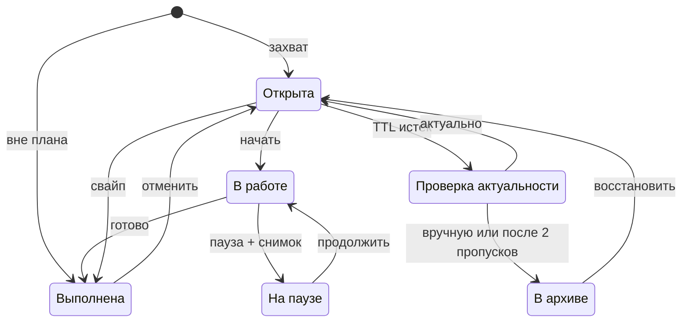

# ТЗ: Android-менеджер задач без обслуживания

Дата: 2026-10-06

## 1. Назначение и цель

Личный менеджер задач для Android, в котором обслуживание системы занимает не больше 10 минут в неделю. Списку можно доверять: в «Сегодня» только то, что реально помещается в день, а устаревшее уходит само.

**Проблема.** Менеджеры задач бросают, когда поддержка списка стоит дороже пользы. Причины: дорогой ввод, бесконечно растущий список, каскад просрочек, обесцененные приоритеты, отрыв от реального времени, потеря контекста, задачи разбросаны по разным приложениям.

**Цель.** Каждое действие по обслуживанию либо выполняется автоматически, либо занимает один тап. Пользователь тратит время на задачи, а не на систему.

**Целевой пользователь.** Один человек с потоком задач из нескольких источников: разработчик, фрилансер, специалист умственного труда. Командная работа в первую версию не входит.

**Платформа.** Android, телефон.

## 2. Принципы продукта

Эти принципы — критерий для любого спорного решения. Требование, которое им противоречит, считается дефектом.

1. **Обслуживание — автоматически или в один тап.** Если действие по поддержке системы требует больше, это дефект.
2. **Система спрашивает, а не требует настройки.** Вопросы приходят пачкой в удобный момент, а не по одному в течение дня.
3. **Все поля, кроме текста, необязательны.** Ввод никогда не блокируется.
4. **Ничего не теряется.** Архив вместо удаления; любое автоматическое действие отменяется в один тап.
5. **«Сегодня» — честный список.** В нём не больше задач, чем помещается в свободное время.
6. **Без чувства вины.** Мягкие даты не просрочиваются, нет счётчиков просрочек и сломанных серий.
7. **Автоматика объяснима.** Каждое автоматическое действие показывает причину, например «не трогали 30 дней».
8. **Работает без сети и без LLM.** Интеллектуальные функции ускоряют работу, но не являются условием её работы.

## 3. Термины

| Термин | Значение |
| --- | --- |
| Задача | Одно конкретное действие, выполнимое за один подход |
| Проект | Контейнер для задач с общим результатом |
| Входящие | Задачи без корзины, ещё не разобранные |
| Корзина | Горизонт задачи: Сегодня, Неделя, Когда-нибудь |
| Дедлайн | Жёсткая внешняя дата; после неё задача просрочена |
| План-дата | Мягкая дата «собираюсь сделать»; не просрочивается |
| Оценка | Грубый размер задачи: S, M или L |
| Ёмкость дня | Свободное время в рабочих часах за вычетом событий календаря и буфера |
| WIP-лимит | Рекомендуемый максимум задач в статусе «В работе» |
| Касание | Любое изменение задачи пользователем: правка, смена статуса, перенос, подтверждение актуальности. Просмотр касанием не считается |
| TTL | Срок без касаний, после которого задача попадает на проверку актуальности |
| Снимок контекста | Заметка «где остановился и что дальше», сохранённая при паузе |
| Источник | Внешний объект, из которого создана задача: сообщение Telegram, issue или PR в GitHub, ссылка |
| Лог сделанного | Хронология выполненных задач |
| Журнал автоматики | Список действий, которые система выполнила сама, с причиной и отменой |
| Обзор | Еженедельная сводка того, что требует решения |

## 4. Сущности и атрибуты

Модель описывает данные на уровне продукта; способ хранения определяет техплан.

### Задача

| Атрибут | Заполняет | Описание |
| --- | --- | --- |
| Текст | Пользователь, обязательно | Формулировка действия |
| Заметка | Пользователь | Свободный текст |
| Статус | Система | Открыта, В работе, На паузе, Выполнена, В архиве |
| Корзина | Пользователь или разбор | Сегодня, Неделя, Когда-нибудь; пусто = Входящие |
| Дедлайн | Пользователь или разбор | Дата, опционально время |
| План-дата | Пользователь или разбор | Дата |
| Оценка | Пользователь или разбор | S, M или L |
| Проект | Пользователь или разбор | Не больше одного |
| Теги | Пользователь или разбор | Любое количество |
| Источник | Система | Ссылка на внешний объект |
| Снимки контекста | Пользователь | Последний показывается первым, история хранится |
| Порядок | Пользователь | Позиция внутри корзины |
| Счётчик переносов | Система | Сколько раз сдвигалась план-дата или задача выпадала из плана дня |
| Последнее касание | Система | Дата |
| На проверке | Система | Признак: задача в очереди проверки актуальности |
| Вне плана | Система | Признак: задача добавлена сразу выполненной |
| Даты создания и выполнения | Система | Дата и время |
| История | Система | Журнал изменений задачи |

### Проект

Название, результат (что значит «готово»), статус (активен, завершён, в архиве), задачи.

### Источник

Тип (Telegram, GitHub issue, GitHub PR, ссылка, другое приложение), ссылка, краткое резюме, состояние во внешней системе.

### План дня

Дата, выбранные задачи в порядке выполнения, ёмкость, перегруз.

### Событие автоматики

Что система сделала, с какой задачей, когда, по какой причине; возможность отмены.

### Жизненный цикл задачи

Устаревшая задача не исчезает молча: сначала проверка актуальности, архив — только по решению пользователя или после 2 пропусков, восстановление в один тап. Задача «вне плана» (CAP-8) создаётся сразу в статусе «Выполнена».

## 5. Функциональные требования

У каждого требования есть идентификатор для трассировки в техплан. Приоритет: **M** — MVP, **L** — следующая версия.

### 5.1 Захват задач

- **CAP-1 (M).** Единая строка ввода доступна на всех основных экранах. Задача сохраняется по Enter.
- **CAP-2 (M).** Разбор естественного языка извлекает текст, план-дату, дедлайн, оценку, проект (#), теги и корзину. Пример: «пт до 18:00 сдать отчёт #client M» → дедлайн пятница 18:00, проект client, оценка M.
- **CAP-3 (M).** Дедлайн и план-дата различаются по маркерам. «до», «к», «дедлайн» → дедлайн; дата без маркера → план-дата.
- **CAP-4 (M).** Распознанные поля показываются чипами под строкой. Чип убирается или исправляется тапом. Сохранение не ждёт подтверждения.
- **CAP-5 (M).** Нераспознанное остаётся в тексте задачи. Задача без корзины попадает во Входящие.
- **CAP-6 (M).** Точки входа: виджет на главном экране, плитка в шторке, системное меню «Поделиться» (текст и ссылки), голосовой ввод.
- **CAP-7 (M).** Ввод работает без сети. Если разбору нужна сеть, задача сохраняется как есть и разбирается при появлении связи; изменения видны в карточке.
- **CAP-8 (M).** Задачу можно добавить сразу выполненной («уже сделал …»). Она попадает только в лог сделанного с признаком «вне плана».
- **CAP-9 (L).** При вводе система предупреждает о похожей открытой задаче и предлагает: открыть её, создать всё равно или объединить.
- **CAP-10 (L).** Захват из Telegram и GitHub — см. 5.8.

### 5.2 Исполнимость и проекты

- **EXE-1 (L).** Система распознаёт размытые формулировки: нет глагола действия, слишком общий объём, признаки проекта («разобраться с», «сделать X целиком»).
- **EXE-2 (L).** Для размытой задачи в карточке появляется подсказка «Какой первый шаг?» с вариантом разбивки на 2–5 шагов. Действия: принять, изменить, пропустить. Сохранение не блокируется.
- **EXE-3 (L).** Принятая разбивка превращает задачу в проект, шаги становятся его задачами.
- **EXE-4 (M).** Проект содержит название, результат и задачи. Задачу можно перенести в проект и вынести из него.
- **EXE-5 (M).** Активный проект без открытых задач помечается «нет следующего шага» и попадает в очередь проверки или обзор.

### 5.3 Даты, корзины и WIP-лимит

- **DAT-1 (M).** Дедлайн — жёсткая дата. После неё задача помечается просроченной. Это единственный «красный» статус в приложении.
- **DAT-2 (M).** План-дата — мягкая. Когда она прошла, задача не просрочивается, а становится кандидатом в план следующего дня; счётчик переносов увеличивается на 1.
- **DAT-3 (M).** После 3 переносов система задаёт вопрос: разбить, отправить в «Когда-нибудь», в архив или оставить. Порог настраивается.
- **DAT-4 (M).** Корзины: Сегодня, Неделя, Когда-нибудь. Числовых приоритетов нет.
- **DAT-5 (M).** Порядок внутри корзины задаётся перетаскиванием. Это единственный способ выразить важность.
- **DAT-6 (M).** Задача с дедлайном в ближайшие 2 дня автоматически становится кандидатом на «Сегодня». Срок настраивается.
- **DAT-7 (M).** Мягкий WIP-лимит статуса «В работе»: по умолчанию 3. При превышении система предлагает поставить одну из задач на паузу; отказ допустим, превышение видно в шапке экрана.
- **DAT-8 (L).** Повторяющиеся задачи: правило повторения, следующий экземпляр создаётся после выполнения или по расписанию. Пропущенные экземпляры не копятся: остаётся только последний.

### 5.4 План дня и ёмкость

- **PLN-1 (M).** Оценки имеют длительность по умолчанию: S — 15 мин, M — 1 ч, L — 3 ч. Значения настраиваются. Задача без оценки считается M.
- **PLN-2 (M).** Ёмкость дня = рабочие часы − занятые события календаря − буфер. Буфер по умолчанию 30%.
- **PLN-3 (M).** Календари устройства читаются только для определения занятости; пользователь выбирает, какие учитывать. Без доступа к календарю ёмкость = рабочие часы − буфер.
- **PLN-4 (M).** Экран «План дня» открывается по утреннему уведомлению или вручную. Кандидаты в порядке: просроченные дедлайны → дедлайны в ближайшие 2 дня → задачи «В работе» и «На паузе» → план-дата сегодня и перенесённые → «Неделя» по порядку.
- **PLN-5 (M).** Автоподбор берёт кандидатов по порядку, пока сумма оценок помещается в ёмкость. Остальное показывается блоком «Не влезает» с действиями: заменить, перенести на завтра, в «Неделю».
- **PLN-6 (M).** План принимается одним тапом. Ручная правка: добавить, убрать, изменить порядок.
- **PLN-7 (M).** Если план превышает ёмкость, показывается перегруз в часах. Добавление не блокируется.
- **PLN-8 (M).** Задача L в плане дня получает подсказку разбить её на части.
- **PLN-9 (M).** Без принятого плана «Сегодня» показывает кандидатов без автоподбора. Приложение работает и без утреннего ритуала.
- **PLN-10 (M).** Невыполненное из «Сегодня» в конце дня возвращается в кандидаты на завтра; счётчик переносов увеличивается. Действий от пользователя не требуется.

### 5.5 Выполнение, пауза и контекст

- **EXC-1 (M).** Переходы статусов: Открыта → В работе → Выполнена; В работе ↔ На паузе; Открыта → Выполнена напрямую; любой статус → В архиве.
- **EXC-2 (M).** Свайп вправо — выполнено, свайп влево — меню переноса: завтра, неделя, когда-нибудь, дата.
- **EXC-3 (M).** Пауза открывает необязательное поле «Где остановился / следующий шаг», текстом или голосом. Пропускается одним тапом.
- **EXC-4 (M).** При возврате к задаче последний снимок контекста показывается первым блоком карточки. История снимков сохраняется.
- **EXC-5 (M).** Ссылки из текста и источника выносятся в карточку кликабельными.
- **EXC-6 (L).** Для задач из Telegram и GitHub система формирует резюме источника до 3 строк и обновляет его при изменениях в источнике.
- **EXC-7 (M).** Выполнение отменяется тапом во всплывающем сообщении и из лога сделанного.

### 5.6 Устаревание (TTL)

- **TTL-1 (M).** Для каждой открытой задачи фиксируется дата последнего касания.
- **TTL-2 (M).** TTL по умолчанию: Входящие — 7 дней, Сегодня и Неделя — 14, Когда-нибудь — 60, проект без активности — 30. Значения настраиваются.
- **TTL-3 (M).** Истёкшая задача не архивируется сразу, а попадает в очередь «Проверка актуальности».
- **TTL-4 (M).** Очередь разбирается карточками: актуально (TTL сбрасывается), в «Когда-нибудь», в архив. Одна задача — одно движение. Каждая карточка показывает причину.
- **TTL-5 (M).** Очередь предлагается не чаще раза в день, пачкой, вместе с планом дня.
- **TTL-6 (M).** Задача, пропущенная в очереди 2 раза подряд, архивируется автоматически с записью в журнале автоматики.
- **TTL-7 (M).** Задачи с будущим дедлайном автоматически не архивируются.
- **TTL-8 (M).** Восстановление из архива в один тап возвращает задачу в прежнюю корзину или проект.
- **TTL-9 (M).** Если во Входящих больше 20 задач, система предлагает быстрый разбор: одна карточка — одно действие (корзина, проект, архив). Порог настраивается.

### 5.7 Еженедельный обзор

- **REV-1 (L).** Обзор формируется автоматически в выбранный день и время; по умолчанию пятница, 17:00.
- **REV-2 (L).** Блоки обзора: застрявшие задачи (3+ переноса, пауза дольше 7 дней), дубли, проекты без следующего шага, просроченные дедлайны, невыполненное из «Недели», выполненное за неделю, действия автоматики.
- **REV-3 (L).** Дубли определяются по смысловой близости текста. Группа объединяется в один тап, заметки и источники всех задач сохраняются.
- **REV-4 (L).** У каждого пункта есть действия в один тап. Цель — пройти обзор за 5 минут.
- **REV-5 (L).** Обзор необязателен и не копится. Пропущенный обзор не переносится, следующий формируется заново; устаревание продолжает работать через TTL.

### 5.8 Интеграции

Задача ссылается на источник, а не копирует его. Внешняя система остаётся источником правды о своём объекте.

**Telegram**

- **TG-1 (L).** Бот принимает пересланное сообщение или текст и создаёт задачу с разбором по CAP-2.
- **TG-2 (L).** Задача хранит ссылку на исходное сообщение и открывает его в Telegram.
- **TG-3 (L).** Бот подтверждает создание коротким ответом с кнопками «Отменить» и «В Сегодня».

**GitHub**

- **GH-1 (L).** Подключение аккаунта и выбор репозиториев.
- **GH-2 (L).** Назначенные issue, PR и запросы на ревью создают задачи автоматически. Правило настраивается по репозиторию и типу объекта.
- **GH-3 (L).** Закрытие issue, merge или закрытие PR закрывает задачу с записью в журнале автоматики.
- **GH-4 (L).** Выполнение задачи в приложении не закрывает issue; приложение предлагает открыть его в GitHub.
- **GH-5 (L).** Название задачи синхронизируется с источником, пока пользователь не переименовал её вручную.

**Календарь**

- **CAL-1 (M).** Чтение занятости из календарей устройства (PLN-3).
- **CAL-2 (L).** По желанию: запись принятого плана дня блоками в выбранный календарь.

**Общее**

- **INT-1 (L).** Отключение интеграции не удаляет созданные задачи; связь с источником помечается неактивной.
- **INT-2 (L).** Доступ любой интеграции отзывается из настроек в один тап.

### 5.9 Уведомления

- **NTF-1 (M).** По умолчанию включены только: утренний план дня, напоминания о дедлайнах, еженедельный обзор (когда он доступен).
- **NTF-2 (M).** Напоминание о дедлайне по умолчанию приходит за 1 день; для дедлайна со временем — ещё за 2 часа. Настраивается глобально и для задачи.
- **NTF-3 (M).** Не больше 3 уведомлений в день, не считая дедлайнов. Лимит настраивается.
- **NTF-4 (M).** В тихие часы уведомления копятся и приходят одной пачкой после них.
- **NTF-5 (M).** Уведомления о задачах содержат действия: выполнено, перенести, открыть.
- **NTF-6 (M).** Повторных напоминаний вида «вы не сделали» нет.

### 5.10 Лог сделанного, поиск, архив, журнал автоматики

- **LOG-1 (M).** Лог показывает выполненное по дням и неделям, включая задачи «вне плана».
- **LOG-2 (M).** Сводка дня: выполнено, из них по плану и вне плана, перенесено. Без серий, рейтингов и сравнений с прошлыми периодами.
- **LOG-3 (L).** Статистика за период: доля выполненного из плана, задачи с частыми переносами, количество ушедших в архив по TTL. Подаётся как сигнал, а не оценка.
- **SRC-1 (M).** Полнотекстовый поиск по тексту, заметкам и снимкам контекста, включая архив.
- **SRC-2 (M).** Фильтры: статус, корзина, проект, тег, тип источника, наличие дедлайна.
- **ARC-1 (M).** Архив хранится без ограничения срока. Окончательное удаление — только вручную, с подтверждением.
- **AUT-1 (M).** Журнал автоматики показывает каждое автоматическое действие: что, когда, почему. Отмена в один тап доступна 30 дней.

### 5.11 Настройки, онбординг, данные

- **SET-1 (M).** Настраиваются: рабочие дни и часы, буфер ёмкости, длительности S/M/L, TTL по корзинам, порог переносов, WIP-лимит, время плана дня, день обзора, тихие часы, лимит уведомлений, язык.
- **SET-2 (M).** У всех настроек есть значения по умолчанию. Приложение полностью работает без захода в настройки.
- **SET-3 (M).** LLM-функции отключаются одним переключателем.
- **ONB-1 (M).** Онбординг — не больше 3 экранов: рабочие часы, доступ к календарю (можно пропустить), первая задача через строку ввода.
- **ONB-2 (M).** Базовые функции доступны без регистрации. Аккаунт нужен только для интеграций и облачной резервной копии.
- **DATA-1 (M).** Экспорт всех данных, включая архив, в JSON и Markdown.
- **DATA-2 (L).** Импорт из текста или CSV: каждая строка становится задачей через стандартный разбор.

### 5.12 ИИ: оформление задач и самонастройка

ИИ оформляет задачу из текста, пользователь пишет только формулировку. Ежедневная автоматика (TTL, переносы, план дня, уведомления) работает на правилах и от ИИ не зависит.

**Точки вызова**

| Точка | Когда вызывается | Результат | Без ИИ |
| --- | --- | --- | --- |
| Разбор при сохранении (CAP-2, TG-1, AI-1–3) | Сохранение задачи; задача сохраняется сразу, поля дозаполняются фоном | Даты, проект, теги, оценка, корзина | Правила: даты, #, S/M/L |
| Похожие задачи (CAP-9, REV-3) | Ввод текста; еженедельный обзор | Кандидаты в дубли | Не работает |
| Размытость и разбивка (EXE-1/2, DAT-3, PLN-8) | Фон после сохранения; 3 переноса; задача L в плане дня | Подсказка и 2–5 шагов | Не работает |
| Резюме источника (EXC-6) | Захват из Telegram и GitHub; изменение источника | 3 строки | Ссылка без резюме |
| Следующий шаг из голоса (AI-6) | Пауза с голосовой заметкой | Строка «следующий шаг» | Сохраняется вся расшифровка |

**Оформление**

- **AI-1 (M).** Если оценка не указана, ИИ определяет S/M/L по тексту и похожим выполненным задачам. Без ИИ — M.
- **AI-2 (L).** Если проект и теги не указаны, ИИ подбирает их по похожим задачам из истории.
- **AI-3 (L).** Если корзина не указана, ИИ определяет её по признакам срочности в тексте и дедлайну. Без признаков задача идёт во Входящие.
- **AI-4 (M).** Поля, заполненные ИИ, помечены и отменяются в один тап. Ручная правка поля имеет приоритет и не перезаписывается.
- **AI-5 (L).** Ручные исправления полей, заполненных ИИ, учитываются в следующих предложениях.
- **AI-6 (L).** Из голосовой заметки при паузе ИИ выделяет следующий шаг отдельной строкой.

**Самонастройка** (статистика, без LLM)

- **TUNE-1 (L).** Длительности S/M/L подстраиваются по фактическому времени задач, прошедших через «В работе».
- **TUNE-2 (L).** Через 2 недели использования система предлагает рабочие часы по времени активности; применение — в один тап.
- **TUNE-3 (L).** TTL корзины растёт, если пользователь чаще подтверждает актуальность, и сокращается, если чаще архивирует. Границы — от ×0,5 до ×2 от значения по умолчанию.
- **TUNE-4 (L).** Каждое изменение пишется в журнал автоматики; в настройках значение помечено «подобрано автоматически» и сбрасывается к умолчанию.

## 6. Экраны и навигация

Нижняя навигация из 4 разделов: Сегодня, Входящие, Задачи, Сделано. Строка ввода закреплена над навигацией на всех четырёх экранах; поиск — в верхней панели.

| Экран | Назначение | Ключевые элементы |
| --- | --- | --- |
| Сегодня (главный) | Что делать сейчас | Задачи «В работе», план дня, ёмкость и перегруз, кнопка «Собрать план» |
| Входящие | Разбор новых задач | Список, быстрый разбор карточками (TTL-9) |
| Задачи | Всё остальное | Вкладки Неделя, Когда-нибудь, Проекты; фильтры |
| Сделано | Прогресс | Лог по дням, сводка дня и недели |
| План дня | Утренний выбор | Кандидаты, автоподбор, блок «Не влезает», принять одним тапом |
| Карточка задачи | Детали | Снимок контекста сверху, поля, источник с резюме, история |
| Проверка актуальности | Разбор устаревших | Карточки с причиной, три действия |
| Обзор недели | Еженедельные решения | Блоки REV-2, действия в один тап |
| Поиск и архив | Найти и вернуть | Строка поиска, фильтры, восстановление |
| Журнал автоматики | Прозрачность | Действие, причина, отмена |
| Настройки и интеграции | Управление | Параметры SET-1, подключение и отзыв интеграций |
| Онбординг | Старт | 3 экрана по ONB-1 |

## 7. Ключевые сценарии

Каждый сценарий — проверяемый путь от начала до результата; по ним строятся приёмочные тесты.

1. **Быстрый захват.** В Telegram пришла просьба клиента. «Поделиться» → приложение → задача во Входящих со ссылкой на сообщение. После выбора приложения — не больше 1 тапа.
2. **Утро.** Уведомление «План готов: 5 задач, 4 ч из 5 ч свободных». Пользователь открывает план и принимает его одним тапом.
3. **Перегруз.** Кандидатов на 6 ч при ёмкости 3 ч. Три задачи попадают в «Не влезает», пользователь переносит их на завтра одним действием.
4. **Прерывание.** Задача в работе, срочный звонок. «Пауза» → голосом «остановился на ретраях, дальше тесты». Через 3 дня заметка видна первой в карточке.
5. **Застрявшая задача.** Задачу перенесли 3 раза. В плане дня появляется вопрос → «Разбить» → система предлагает 3 шага → пользователь принимает.
6. **Устаревание.** Задачу во Входящих не трогали 7 дней. Она в очереди проверки, пользователь отправляет её в архив свайпом. Через месяц находит поиском и восстанавливает в один тап.
7. **Возврат после перерыва.** Приложение не открывали 2 недели. При открытии нет лавины просрочек: просрочены только задачи с дедлайнами, устаревшее собрано в одну очередь проверки, план дня собран заново.
8. **GitHub.** PR назначен на ревью → появилась задача. PR смержен → задача закрылась, событие видно в журнале автоматики.

## 8. Нефункциональные требования

| Область | Требование |
| --- | --- |
| Скорость захвата | От виджета до сохранённой задачи — не больше 2 тапов плюс ввод текста |
| Отклик | Холодный старт до готовой строки ввода — не больше 1,5 с на телефоне среднего класса |
| Офлайн | Все функции, кроме интеграций и LLM-функций, работают без сети |
| Деградация LLM | Без LLM работает разбор по правилам (даты, #, оценки, корзины); недоступны разбивка, резюме источников, поиск дублей |
| Приватность | Отправка текстов на внешнюю обработку — только после явного согласия; отправляется минимум, нужный конкретной функции |
| Сохранность | Ни одно действие не удаляет данные без явного подтверждения. Ежедневная локальная резервная копия; облачная — при наличии аккаунта |
| Безопасность | Токены интеграций хранятся в защищённом системном хранилище. Опциональная блокировка приложения биометрией |
| Энергопотребление | Фоновая работа только для уведомлений, синхронизации интеграций и проверки TTL; без постоянного фонового процесса |
| Время | Дата без времени привязана к локальному дню; дедлайн со временем хранит часовой пояс |
| Локализация | Интерфейс и разбор дат: русский, украинский, английский |
| Доступность | Поддержка экранного диктора и крупного шрифта; каждое свайп-действие дублируется кнопкой |
| Темы | Светлая и тёмная, по системной настройке |
| Устройства | Телефоны Android. Планшеты и складные — адаптивная раскладка без отдельных сценариев. Минимальную версию ОС определяет техплан |

## 9. Границы версий

MVP проверяет главную гипотезу: список, который обслуживает себя сам, не бросают. Интеграции и обзор добавляются после.

| Версия | Что входит |
| --- | --- |
| MVP | Все требования с пометкой M: захват и разбор, две даты, корзины, WIP-лимит, план дня под ёмкость, пауза и контекст, TTL и проверка актуальности, лог, поиск, архив, журнал автоматики, уведомления, экспорт, ИИ-оценка и пометка ИИ-полей |
| Следующая версия | Требования с пометкой L: разбивка задач, еженедельный обзор и дубли, Telegram, GitHub, запись плана в календарь, статистика, повторяющиеся задачи, импорт, ИИ-подбор проекта и корзины, самонастройка |
| Вне рамок | Командная работа и общий доступ, синхронизация между устройствами, iOS и веб, геймификация, вложенные подзадачи (их роль выполняют проекты) |

## 10. Критерии приёмки MVP

MVP принят, когда выполняются все пункты.

- [ ] Задача создаётся из виджета не больше чем за 2 тапа плюс ввод текста.
- [ ] «пт до 18:00 сдать отчёт #client M» разбирается в дедлайн, проект и оценку; «завтра позвонить» — в план-дату.
- [ ] Задача с прошедшей план-датой не помечена просроченной и стоит в кандидатах на сегодня.
- [ ] После 3 переносов в плане дня появляется вопрос из DAT-3.
- [ ] Автоподбор плана не превышает ёмкость; лишнее показано в «Не влезает».
- [ ] Задача без касаний дольше TTL попадает в очередь проверки, а не в архив.
- [ ] Любое автоматическое действие видно в журнале с причиной и отменяется в один тап.
- [ ] Снимок контекста, сохранённый при паузе, показывается первым при открытии задачи.
- [ ] После 14 дней без открытия приложения просрочены только задачи с дедлайном.
- [ ] Все функции MVP, кроме LLM-разбора, работают в режиме полёта.
- [ ] С отключёнными LLM-функциями проходят сценарии 1–4, 6 и 7.
- [ ] Экспорт выгружает все задачи, включая архив, со всеми полями.

## 11. Метрики успеха

Целевые значения — стартовое предложение; уточняются по итогам беты.

| Метрика | Цель | Что показывает |
| --- | --- | --- |
| Время на обслуживание в неделю (разбор Входящих, проверка, обзор) | ≤ 10 мин | Работает ли главный принцип |
| Доля задач плана дня, выполненных в тот же день | ≥ 60% | Честность ёмкости |
| Медиана переносов на задачу | ≤ 1 | Реалистичность планирования |
| Доля задач, созданных через виджет, «Поделиться» и интеграции | Растёт | Дешевизна захвата |
| Удержание на 8-й неделе | Ориентир после беты | Не бросают ли приложение |
| Доля задач, ушедших в архив по TTL | Ориентир после беты | Слишком мало — TTL не работает; слишком много — захватывается лишнее |

## 12. Открытые вопросы

- [ ] Синхронизация между устройствами: только один телефон в v1 или сразу несколько?
- [ ] Где обрабатывается язык: на устройстве или внешним сервисом? Решение влияет на приватность, офлайн и стоимость.
- [ ] Переносить ли повторяющиеся задачи (DAT-8) в MVP?
- [ ] Нужен ли аккаунт в MVP, если интеграций там нет и облачная копия — единственная причина?
- [ ] Языки разбора в MVP: все три или сначала один?
- [ ] Монетизация: что входит в бесплатную версию.
- [ ] Рабочее название продукта.
